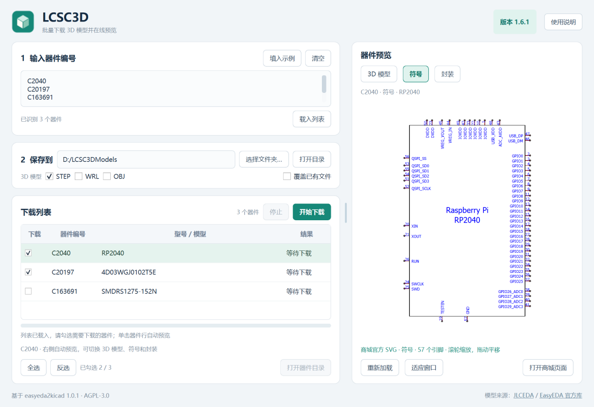

# LCSC3D

[](https://github.com/Travelerrrrrr/LCSC3D/actions/workflows/windows.yml)
[](LICENSE)

Windows 10/11 x64 便携工具，用立创商城 C 编号批量下载 3D 模型，并预览 3D、符号和封装。当前版本 **1.6.1**。

**[下载最新版本](https://github.com/Travelerrrrrr/LCSC3D/releases/latest)** · [完整使用说明](app/README.md) · [版本历史](docs/版本历史.md)



## 功能

- 支持 STEP、WRL、OBJ 三种 3D 格式，每个器件保存到独立的“器件名_编号”目录。
- 下载列表提供勾选框、全选和反选，仅下载勾选的元件。
- 载入列表即后台查询型号，未勾选元件也显示型号，无须先下载。
- 3D 使用商城官方在线查看器；符号和封装使用官方 SVG，支持缩放、平移、适应窗口和多单元符号。
- 下载期间可继续预览；支持停止、保留已有文件和覆盖更新。
- 国内官方接口优先，失败时回退官方镜像；连接池、受控并发和有界内存缓存。

只导出 3D 模型，不导出符号库或封装库，不生成 CSV。

## 使用

1. 从 [Releases](https://github.com/Travelerrrrrr/LCSC3D/releases/latest) 下载 `LCSC3D.exe`，直接运行，无须安装 Python、KiCad 或额外浏览器运行时。
2. 输入 C 编号，例如 `C2040, C20197, C163691`，点击“载入列表”。
3. 查看型号，勾选需要下载的元件；可使用“全选”“反选”。
4. 选择保存目录和 3D 格式，点击“开始下载”。

下载和在线预览需要联网。部分器件没有 3D 模型，3D 预览需要支持 WebGL 的显卡驱动。

每个 Release 提供 `LCSC3D.exe`、包含固定版本上游源码的 `LCSC3D.zip` 和 `SHA256SUMS.txt`。软件名称与文件名保持固定，版本号单独显示。

## 源码运行与构建

Windows x64、Python 3.12：

```powershell
git clone --recurse-submodules https://github.com/Travelerrrrrr/LCSC3D.git
cd LCSC3D
python -m venv .venv
.\.venv\Scripts\python.exe -m pip install -r app/requirements.txt
.\.venv\Scripts\python.exe app/main.py
```

构建独立 EXE：

```powershell
.\app\build.ps1
```

构建脚本安装固定版本依赖，运行测试，然后生成 `app/dist/LCSC3D.exe`。无需 C++ 或 Qt 开发环境。已有克隆可用 `git submodule update --init --recursive` 获取上游源码。完整源码 ZIP 已包含上游，无须额外获取。

## 开发

```powershell
.\.venv\Scripts\python.exe -m unittest discover -s app/tests -v
```

目前有 64 项测试，涵盖下载、型号查询、勾选过滤、缓存、取消、官方 SVG、预览交互和窗口稳定性。[贡献指南](CONTRIBUTING.md)包含构建、验证和发行步骤。

```text
app/       应用、测试、资源和第三方许可证
scripts/   源码打包、发行验证和性能测量工具
upstream/  easyeda2kicad Git 子模块，固定到 v1.0.1
docs/      使用记录、历史、性能数据和截图
.github/   Windows 自动测试与构建
```

`work/`、`outputs/`、虚拟环境、构建缓存、日志和个人设置均不上传。已有开发历史保留。成品验证见 [验证记录](docs/验证记录.md)，性能测量见 [性能优化记录](docs/性能优化.md)。

## 许可证与来源

项目代码采用 [AGPL-3.0-or-later](LICENSE)。第三方软件遵循各自许可证，详见 [第三方声明](app/licenses/THIRD-PARTY.md)。

- 上游转换器：[uPesy/easyeda2kicad.py](https://github.com/uPesy/easyeda2kicad.py)，固定提交 `20c754d0fc1fec94e7fab2112b66ea576e8db369`。
- 模型和元件数据来自 [嘉立创EDA / JLCEDA 官方库](https://lceda.cn/) 与 [EasyEDA 官方库](https://easyeda.com/)。软件许可证不替代这些数据的版权或使用条件。
- 官方 3D 查看器脚本在运行时加载，不打包复制商城前端。符号、封装直接读取官方 SVG 接口。

本项目为社区工具。问题和建议可提交到 [Issues](https://github.com/Travelerrrrrr/LCSC3D/issues)。
