<p align="center">
  <picture>
    <source media="(prefers-color-scheme: dark)" srcset="app/assets/branding/lcsc3d-logo-dark.svg">
    
  </picture>
</p>

# LCSC3D：立创元件 3D 模型下载与 Altium Designer 元件库导出

[](https://github.com/Travelerrrrrr/LCSC3D/releases/latest)
[](https://github.com/Travelerrrrrr/LCSC3D/actions/workflows/windows.yml)
[](https://github.com/Travelerrrrrr/LCSC3D/releases/latest)
[](LICENSE)
[](docs/sponsorship.md)

**从立创商城搜索、账号收藏或 C 编号选择元件，查看价格、库存和资料，批量下载 STEP / OBJ、导出 AD 元件库并预览。**

LCSC3D 是面向硬件开发、PCB 设计和结构配合的 Windows 便携工具。它把商城选型、账号收藏、模型下载、Altium Designer 元件库导出和四类预览放在一起。下载 `LCSC3D.exe` 即可运行，无须安装 Python；导出 AD 库也无须在电脑上安装 Altium Designer。

**当前版本：2.2.1** · **[下载 Windows 程序](https://github.com/Travelerrrrrr/LCSC3D/releases/latest/download/LCSC3D.exe)** · [完整源码包](https://github.com/Travelerrrrrr/LCSC3D/releases/latest/download/LCSC3D.zip) · [使用说明](app/README.md) · [本版更新](docs/releases/v2.2.1.md) · [问题反馈](https://github.com/Travelerrrrrr/LCSC3D/issues)

**新 Logo、新界面、备份可恢复。** 2.2.1 使用蓝色 L 标识和默认浅色品牌蓝，将工作台、商城、登录与设置整合到一个窗口；支持管理自动备份、查看占用空间、恢复与清理备份。

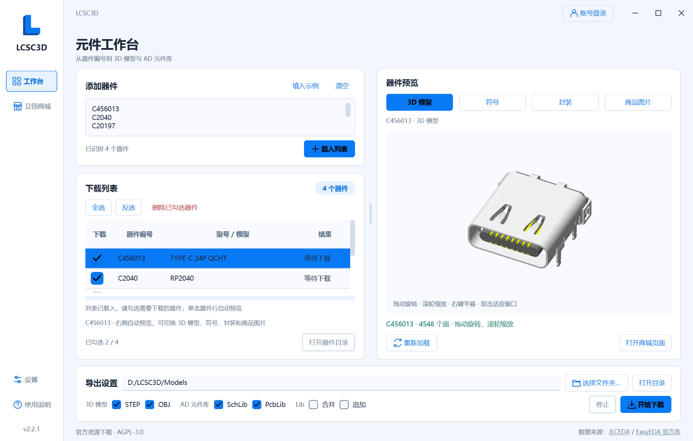

## 2.2.1 更新重点

| 更新 | 使用方式与效果 |
| --- | --- |
| **一体化窗口** | 系统标题栏并入应用顶部，保留最小化、最大化/还原、关闭、拖动和边角缩放；商城、登录、图片、设置及帮助均在主窗口内切换。 |
| **新 Logo 与默认浅色** | 界面、EXE 和窗口图标全面更新；首次启动采用浅色与品牌蓝，已有主题设置继续沿用。 |
| **备份管理与恢复** | 设置中开关自动备份、查看数量和占用空间、恢复选中备份或清除备份；恢复覆盖前保留当前文件。 |
| **主题、字体与语言** | 中文 / English、跟随系统 / 浅色 / 深色、预设与自定义配色、按钮文字颜色、字体及 10–24px 字号。 |
| **国际商城** | English 使用 LCSC 国际站的英文商品资料、美元价格、库存和原图。 |
| **设置与支持** | 外观、网络、日志与诊断、关于与支持、备份五类设置；保留“⭐点个Star⭐”与“🍔赞助作者🍔”。 |

库合并、追加、PCB 工程联动、相同 footprint 复用及独立导出继续保留。旧版改动见 [版本历史](docs/版本历史.md)。以下软件截图均来自 2.2.1 的实际运行；公开商品价格与库存以使用时查询结果为准。

## 功能一览

| 功能 | 可以做什么 |
| --- | --- |
| 商城搜索 | 按 C 编号、型号或关键词搜索，每页 50 个，按需翻页，保留跨页勾选。 |
| 单价与库存 | 查看商城现货库存，每个商品独立切换人民币价格梯度，默认 1+ 或最低可购买梯度。 |
| 账号收藏 | 原生登录后读取账号收藏，将搜索商品收藏到账号，或取消指定元件的收藏。 |
| 商品资料与原图 | 查看完整介绍和参数，打开全部原图，支持缩放、平移和图片切换。 |
| 批量型号查询 | 输入多个 C 编号，自动查询元件型号，合并重复编号，逐项显示结果。 |
| STEP / OBJ 下载 | 获取官方 3D 模型，用于机械装配、结构空间检查或其他 3D 工作流程。 |
| AD 原理图库 | 生成原生 `.SchLib`，保留引脚名称、编号、电气类型和多单元结构。 |
| AD PCB 封装库 | 生成原生 `.PcbLib`，保留焊盘、钻孔、槽孔、铜区及封装图形。 |
| 四类预览 | 在 3D 模型、原理图符号、PCB 封装和商品图片之间切换，下载前即可查看。 |
| 库与 PCB 工程 | 合并时可保留单独库，支持追加已有库并添加到 `.PrjPcb` 工程。 |
| 下载选择 | 按器件勾选，支持全选、反选，删除勾选的列表记录，可自由组合四种输出格式。 |
| 任务与文件管理 | 显示进度和逐项结果；可以停止任务、打开器件目录、重新获取同名文件。 |
| 便携与自更新 | 单个 EXE 直接运行，保存目录及格式设置自动记忆，支持检查更新、校验和重启更新。 |
| 设置与日志 | 商城和检查更新独立选择系统代理或直连；调整日志等级，打开、打包或清除日志。 |
| 备份与恢复 | 自动备份开关、空间统计、恢复旧文件、恢复前保护副本及清理确认。 |

## 主题、代理设置与日志

**设置 → 外观 → 主题设置** 提供以下选项，保存后立即生效并在下次启动时恢复；取消保留原设置。

- **语言 / Language**：简体中文、English。English 在软件内搜索 [LCSC 国际商城](https://www.lcsc.com/)，显示英文商品资料、美元价格、库存与原图；宽泛关键词可切换商品分类，每页最多 50 项。商品链接也随语言切换，下载列表及已有勾选保留。
- **明暗模式**：默认浅色，可选择跟随系统或深色。选择跟随系统时响应运行期间的系统明暗变化。
- **APP 配色**：默认品牌蓝 `#087AF5`，与 Logo 一致；也可选青绿、蓝色、紫色、玫红、橙色或自定义颜色。按钮、选中状态、进度条和重点文字同步更新。
- **按钮文字颜色**：自动、白色、黑色，或点击 **选择文字颜色…** 自定义。手动颜色用于彩色按钮及选中项，切换配色、浅色或深色后仍保留；选择“自动”恢复黑白对比度判断。
- **界面字体**：从本机已安装字体中选择，下拉列表最多显示 8 项，其余滚动查看，选中后在下方预览。支持恢复默认；保存后主窗口、各页面和 3D 预览操作提示同步生效，换电脑后找不到所选字体时自动回退。
- **界面字号**：支持 10–24px，可输入数值或用减号/加号调整，默认 13px；先预览，保存后生效并记住。标题、提示与列表行高同步调整，大字号下主窗口内容可滚动。
- 深色模式的普通勾选框、商城选择框和下载选择框使用清晰描边，已勾选、未勾选和禁用状态容易区分。

例如，想保留青绿色背景并使用白字，可将 **按钮文字颜色** 设为 **白色** 后保存。

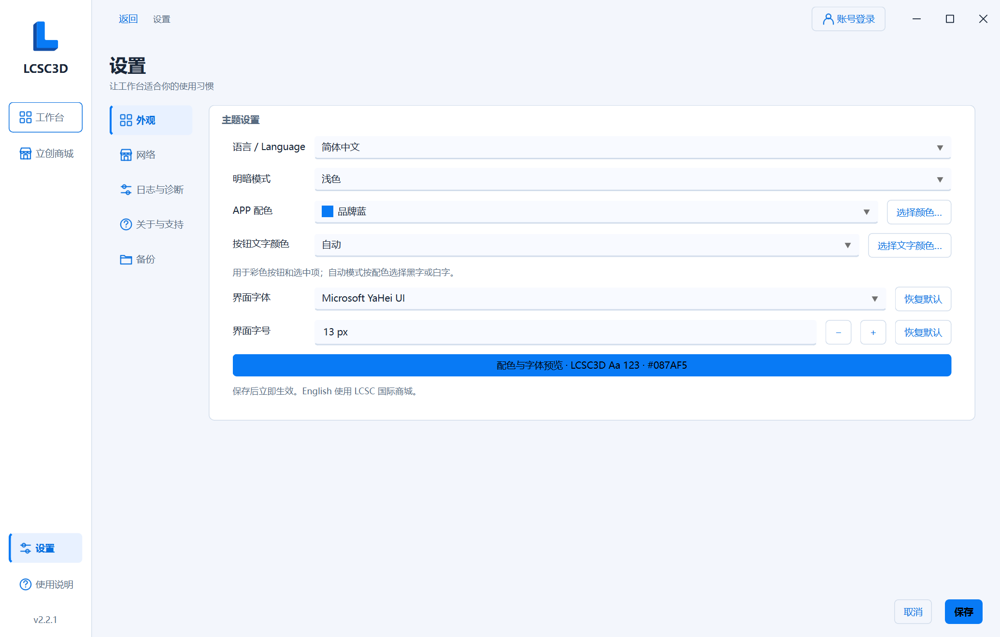

国际站登录和账号收藏在 LCSC.com 网页管理，软件内提供对应入口；国内账号与国际站会话不混用。切回简体中文即可使用原有国内商城搜索、登录和收藏。符号与封装保留官方图形的原始颜色。

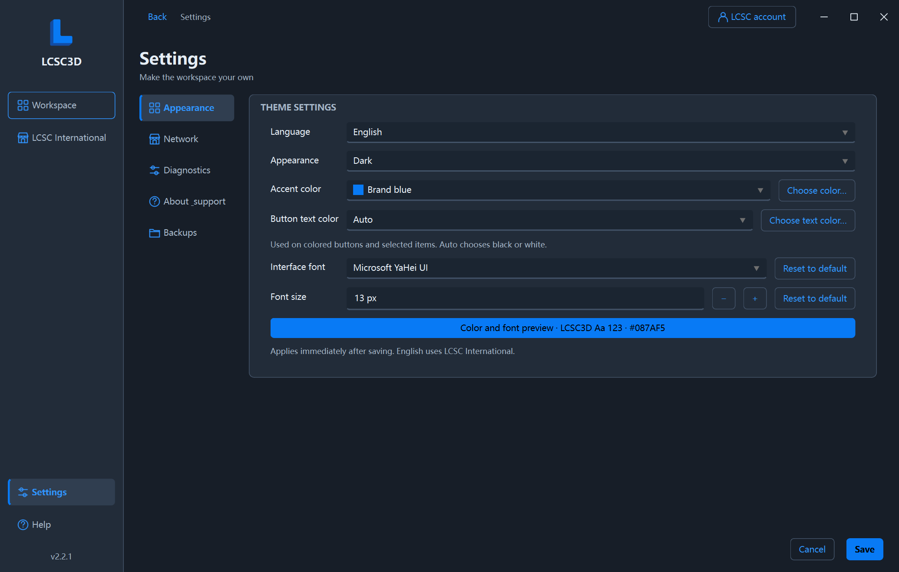

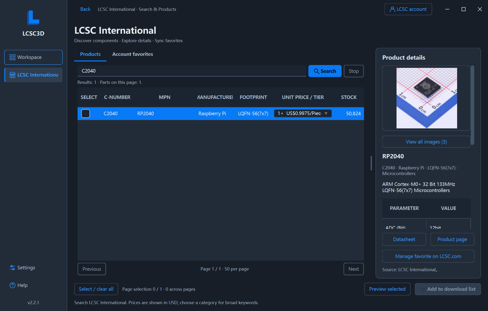

主窗口左侧点击 **设置 → 关于与支持 → 检查更新** 可手动检查新版，启动后台检查继续保留。点击 **设置**，可分别为 **立创商城** 和 **检查更新** 选择 **使用系统代理 / 不使用系统代理**，默认均使用系统代理。商城选项覆盖登录、搜索、收藏、图片及元件资源，更新选项覆盖新版检查和更新包下载。保存后对新请求立即生效，当前登录保留，重启后恢复设置。

**日志** 支持 Debug、Info、Warning、Error、Critical，默认 Debug。点击 **打开日志** 打开日志目录。商城、登录、下载、AD 导出、预览及自更新均记录关键步骤、结果和错误，包含操作关联编号、元件/格式、系统码、原因链及代码位置；不保存登录凭据，并自动轮转限制大小。详见 [日志排查](docs/日志排查.md)。

**打包日志** 将主程序、更新助手、轮转和崩溃日志，以及软件/系统版本、当前代理模式和日志等级打成 ZIP，保存到 `%LOCALAPPDATA%/LCSC3D/diagnostics/`，完成后打开所在目录。反馈时发送 ZIP，并附发生时间、操作步骤与截图。**清除日志** 经确认后清除日志，随后继续记录；已打包的 ZIP 保留。

配置、日志、会话、缓存、临时文件及更新数据统一存放在 `%LOCALAPPDATA%/LCSC3D/`，不在 EXE 旁生成配置文件。旧配置自动迁移，默认导出目录为其中的 `downloads/`，可主动选择其他目录。

设置窗口 **关于与支持** 页的 **赞助与支持** 提供仓库首页和作者收款码入口，点击即可使用，无须保存设置。赞助自愿，金额随意。

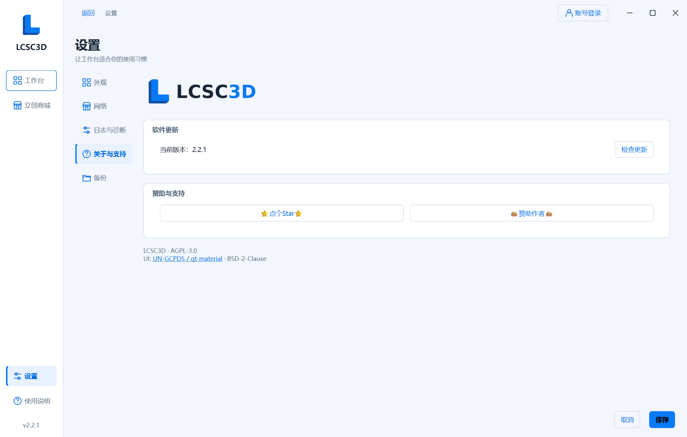

## 备份与恢复

**设置 → 备份** 显示备份数量、占用空间、文件名、原路径和时间。自动备份默认开启，可关闭后保存；追加或修改已有 SchLib、PcbLib 和 PCB 工程时按此设置保留旧文件。

选择一份备份后点击 **恢复选中备份**，确认恢复路径后执行；覆盖已有文件前会保留该文件的当前内容，即使自动备份已关闭。旧版备份也可恢复，需要手动指定目标路径。**清除备份** 经确认后只删除列出的备份，原有库与工程保持不变。详见 [备份与恢复说明](app/README.md#备份与恢复)。

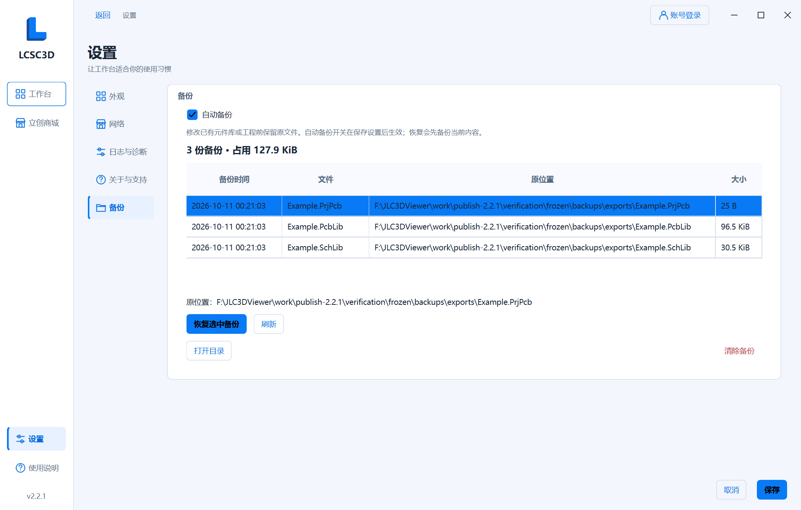

## 商城搜索、价格与商品详情

点击主窗口的 **立创商城**，输入 C 编号、型号或关键词即可搜索。商城在当前窗口内显示；点击 **预览选中元件** 后切回工作台，返回商城后当前页和选择保留。新搜索和账号收藏中的元件默认不勾选，高亮行用于查看和预览，勾选用于导入下载列表。

每页最多 **50 个元件**，点击上一页或下一页才获取目标页。跨页勾选会保留，**加入下载列表** 导入本次搜索各页勾选的元件；全选只作用于当前页。新搜索清空上一轮的勾选与价格梯度选择。

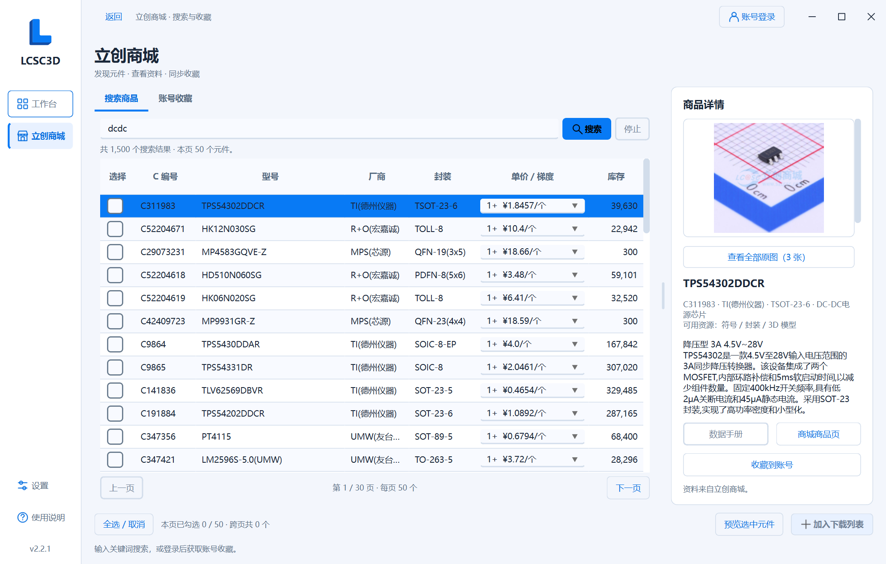

价格列列出每个商品实际提供的人民币单价梯度，保留原始小数精度。默认显示 **1+**；最低 5 个起订时显示 **5+ 对应单价**，只有更高起始梯度时使用最低可用梯度。库存显示商城现货数量，零库存显示 `0`，缺少价格或库存显示 `—`。翻页后返回仍保留该商品手动选择的梯度。

右侧商品介绍和参数自动换行，文字详情区可以上下滚动。图片、原图入口、数据手册和收藏按钮保持可见，长参数完整显示。

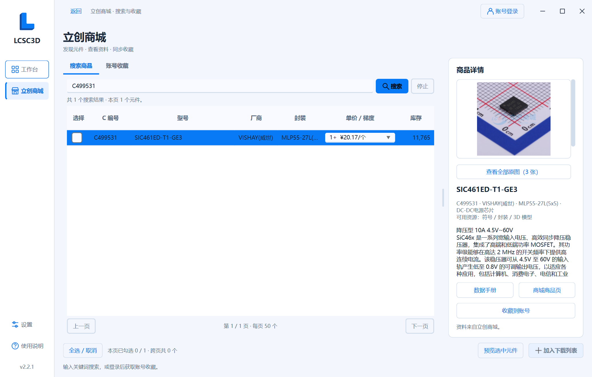

## 登录、记住登录与账号收藏

应用右上角 **账号登录** 在所有页面共用登录状态，应用内登录页支持 **微信扫码、账号密码、手机验证码**。若商城要求图片验证，可在原生登录框完成，支持换图；短信发送后显示 60 秒重试倒计时。

| 账号密码登录 | 手机验证码登录 |
| --- | --- |
| <a href="docs/images/2.2.1-release/login-password.png">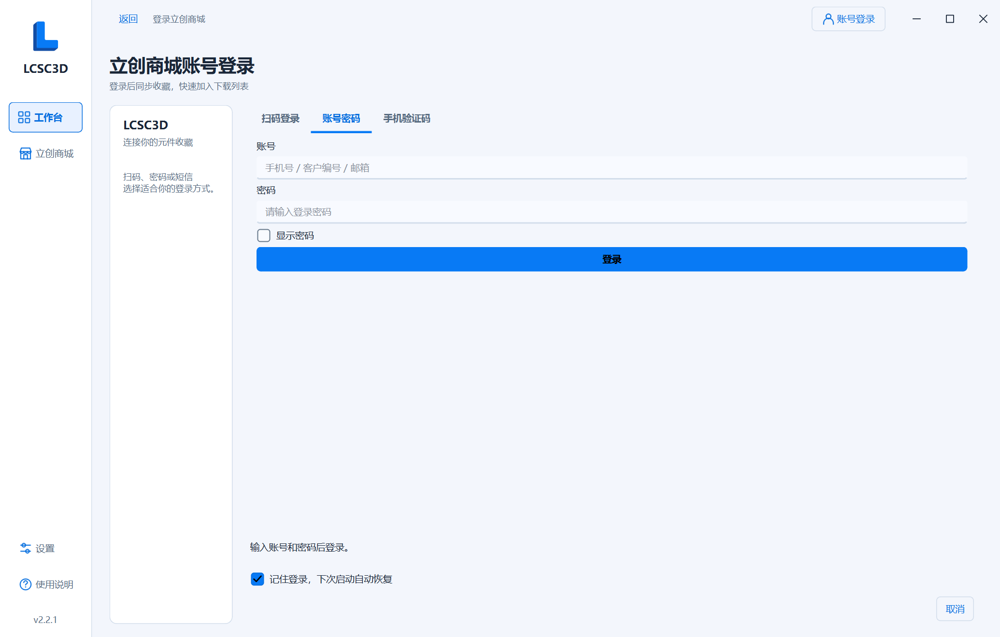</a> | <a href="docs/images/2.2.1-release/login-sms.png">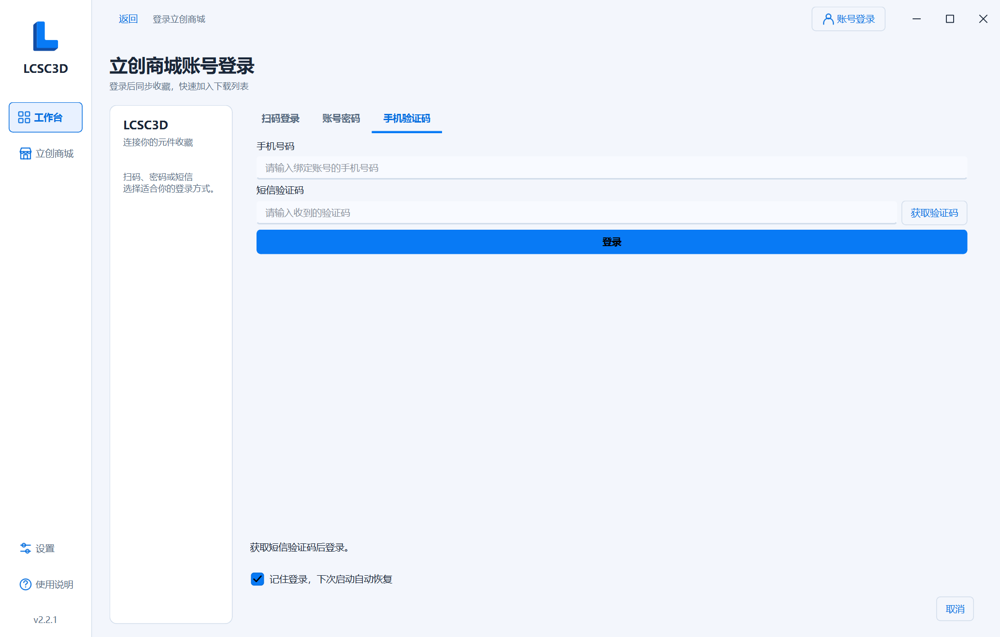</a> |

**记住登录** 默认开启，会话有效时重启软件自动恢复。登录状态使用 Windows 当前用户加密，只保存会话，不保存账号密码；**退出登录** 清除保存的会话。

登录后打开 **立创商城 → 账号收藏**，点击 **获取收藏** 刷新，勾选元件并 **加入下载列表**。搜索商品可 **收藏到账号**，已有收藏可 **取消收藏**；取消账号收藏和删除下载列表记录分别控制账号收藏与本地队列，已下载文件保留。

## 商品原图与放大

点击商品图片或 **查看全部原图** 打开图片窗口。缩略图、上一张/下一张和方向键可切换图片；滚轮或按钮缩放，拖动平移，支持原始大小和适应窗口。

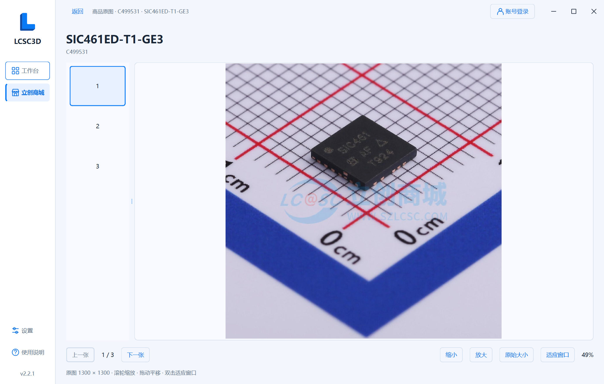

## 原生 Altium Designer 元件库

### 原理图库 SchLib

勾选 `SchLib` 后，软件从官方元件结构数据生成 AD 原理图库。库中保留引脚的名称、真实编号、电气类型、方向及可见性，支持字母编号、组合编号和多单元符号，也保留文字、轮廓和来源参数。

多单元元件按各单元的原点及引脚归属导出。符号的 PCB 模型引用与封装库中的封装名称对应，方便在 AD 中配合使用。

### PCB 封装库 PcbLib

勾选 `PcbLib` 后，软件生成 AD PCB 封装库。支持常见贴片和通孔焊盘、矩形/圆形/椭圆焊盘，以及原始数据带有有效轮廓的多边形、自定义和凹形焊盘；保留孔径、槽长、旋转、铜孔偏移、镀孔状态及阻焊/锡膏扩展等信息。

遇到暂不支持的图元或多轮廓区域时，软件会提示该格式导出失败；同一任务中其他成功的资源仍会保存。没有关联 3D 模型的元件，也可以单独导出可用的符号库和封装库。

生成文件可在 Altium Designer 中打开或安装使用，当前不生成 IntLib。

### 3D 模型需要手动添加到 PcbLib

**当前导出的 PcbLib 不自动嵌入或绑定 3D 模型。** 如果需要在 AD 中显示三维封装，请同时下载 `STEP`，在 PcbLib 编辑器中添加 3D Body 并导入该 STEP 文件。导入后需根据焊盘与器件实际安装位置核对 **XYZ 位置、高度和旋转角度**，必要时手动调整角度与偏移。

原因是官方 3D 模型作为独立文件提供，其原点、坐标轴方向及摆放角度可能与 AD 封装库的坐标体系不同。当前导出尚未把官方封装中的 3D 关联、位置和旋转信息转换为 AD 3D Body 参数，因此直接导入模型后，朝向与高度不一定已经对齐。

**后续版本会增加 3D 模型自动嵌入 PcbLib 的功能，并完善模型与封装的关联、位置和角度处理。**

## STEP / OBJ 模型与四类预览

| 资源 | 用途 | 预览操作 |
| --- | --- | --- |
| 3D 模型 | 原样保存官方 STEP、OBJ。STEP 适合 SolidWorks、FreeCAD 等 CAD 软件；OBJ 可用于其他支持该格式的 3D 工具。 | 左键拖动旋转，滚轮缩放，右键拖动平移。 |
| 原理图符号 | 查看官方符号图形、引脚名称和编号；多单元元件可选择单元。 | 滚轮缩放，左键拖动平移。 |
| PCB 封装 | 查看焊盘、孔位、轮廓、编号和官方图层配色。 | 滚轮缩放，左键拖动平移。 |
| 商品图片 | 查看商城商品原图，多图可切换。 | 滚轮缩放，拖动平移，上一张/下一张。 |

载入列表后自动预览首个元件，单击其他行即可切换。四类预览都支持“适应窗口”和双击恢复视野，加载失败时可以“重新加载”，也可以直接打开商城页面。

选择 **商品图片** 可在主页查看商城原图，多张图片用上一张/下一张切换，支持缩放、拖动和重新加载。

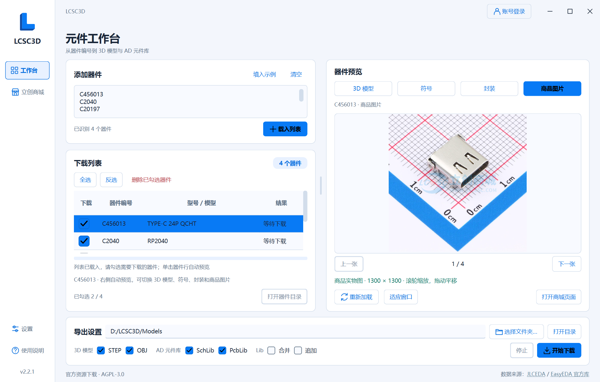

3D 初始视角保持元件顶部朝上。切换器件和下载进度更新时，预览仍可操作；资源可以先查看，再决定需要保存哪些格式。

### 原理图符号预览

同一 Type-C 连接器的符号预览，可查看 A1～A12、B1～B12 等实际引脚编号。

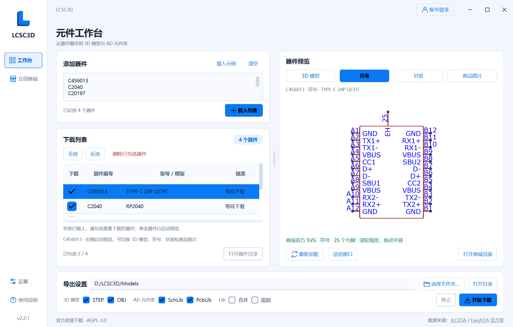

### PCB 封装预览

同一元件的封装预览，可查看焊盘编号、固定孔、轮廓和图层颜色。

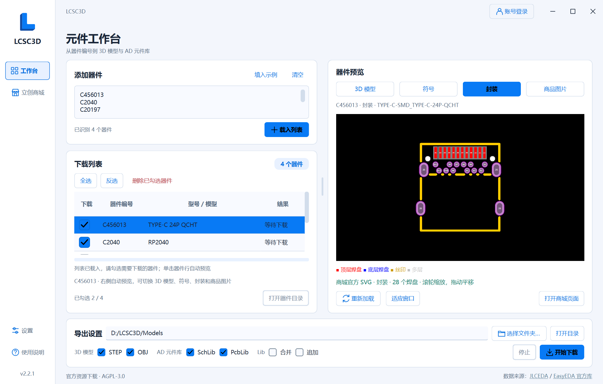

### 与立创商城官方页面对照

下图为相同 C456013 元件在立创商城中的符号、封装和 3D 模型，可与上面的软件截图对照查看。软件中的符号与封装预览使用官方图形，3D 预览读取官方模型。

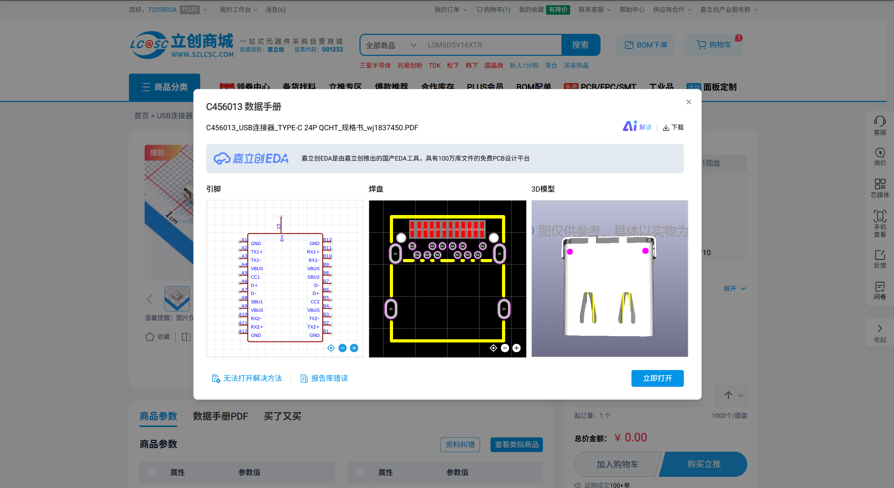

## 追加已有库和加入 PCB 工程

勾选 **Lib → 追加**，选择已有 SchLib/PcbLib，可只选一种库；相同 footprint 复用已有条目，同名但内容不同的 footprint 使用序号分别保存。“保存到”路径变灰，导出位置跟随库或工程。**独立导出器件** 控制是否另存逐器件库与模型；关闭时模型集中到 SchLib（仅有 PcbLib 时为 PcbLib）旁的 **库名_3D** 文件夹。

同时指定已有库和 `.PrjPcb` 后，可勾选 **将已选已有库导入PCB工程**，下载完成后将成功追加的库加入工程；下载列表为空时，主页 **导入已有库** 可直接加入所选库。只指定工程时，在工程旁按工程名称创建或追加配套库。默认写入前自动备份到 AppData，可在设置中管理备份开关、恢复和清理。详见 [使用说明](app/README.md#追加已有库与-pcb-工程)。

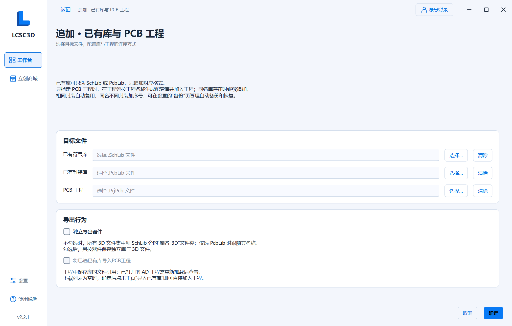

<details>
<summary>查看商城加入下载列表后的导入结果提示</summary>

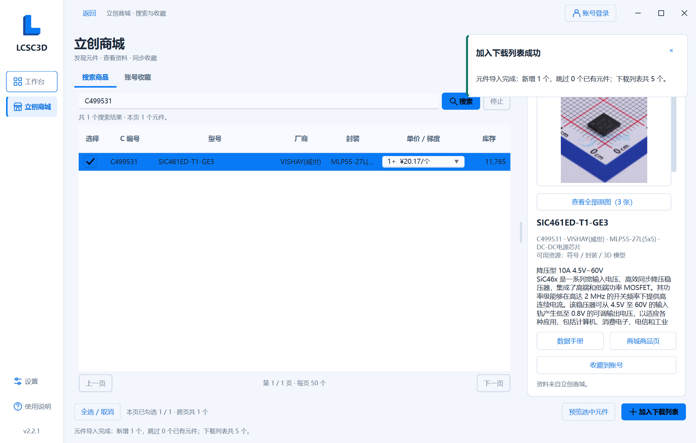

</details>

## 批量下载与文件管理

- **灵活输入**：支持换行、空格、中英文逗号和分号，C 编号不区分大小写；重复编号自动合并。
- **先查询，再勾选**：载入列表后后台查询全部元件型号，下载只处理勾选的器件。全选、反选和当前预览行分别控制选择与查看。
- **删除勾选器件**：从下载列表及输入框移除打勾的器件，保留其他器件的结果和已下载文件；下载期间禁用删除。
- **合并元件库**：勾选“Lib → 合并”后配置 SchLib/PcbLib 合并开关与名称，本次成功转换的器件保存到目录根部的合并库；同名库在生成成功后替换。
- **自由组合格式**：`STEP`、`OBJ`、`SchLib`、`PcbLib` 可任意组合，也可仅导出 AD 库。
- **逐项反馈**：展示本次任务进度及成功、部分完成、无模型或失败等结果；一种格式失败时保留其他成功资源。
- **自动覆盖更新**：每次下载重新获取所选资源，覆盖已有同名文件。获取或生成成功后才替换，失败或取消时保留原文件。
- **停止与重试**：停止任务会保留已完成文件；重新下载需要更新的器件即可。
- **设置记忆**：保存目录和格式选项自动记忆，器件目录与商城页面可从软件中直接打开。

普通导出的文件保存在独立的 **“元件型号_C编号”** 文件夹中。合并或追加时未启用独立导出，STEP/OBJ 集中到优先库的 **库名_3D** 文件夹。独立 AD 库文件使用元件型号命名，库内名称不自动追加 C 编号；STEP/OBJ 文件保留编号与模型名称。文件名中的 Windows 禁用字符会替换为下划线。

```text
所选保存目录/
└─ RP2040_C2040/
   ├─ RP2040.SchLib
   ├─ RP2040.PcbLib
   ├─ C2040_LQFN-56_L7.0-W7.0-P0.4-EP.step
   └─ C2040_LQFN-56_L7.0-W7.0-P0.4-EP.obj
```

## 开始使用

1. 从 [Releases](https://github.com/Travelerrrrrr/LCSC3D/releases/latest) 下载 `LCSC3D.exe`，在 Windows 10/11 x64 上直接运行。
2. 点击 **立创商城** 搜索元件，或登录后从账号收藏勾选并加入下载列表；也可手动输入 `C2040, C20197, C456013` 并点击“载入列表”。
3. 单击器件行查看预览，勾选需要下载的器件；可使用“全选”“反选”或“删除已勾选器件”。
4. 选择保存目录和所需格式，点击“开始下载”。
5. 点击“打开器件目录”查看文件。在 AD 中打开或安装 SchLib / PcbLib；STEP / OBJ 可交给对应的 CAD 或 3D 工具使用。

## 在 Altium Designer 中查看

以下三张由用户提供，展示测试库在 **Altium Designer 中实际打开**的符号、PCB 封装，以及 `.PrjPcb` 工程中的两类库引用。截图采用用户测试库中的名称；程序追加时保留已有条目的原名称。

| AD 中的原理图库 | AD 中的 PCB 封装库 |
| --- | --- |
| <a href="docs/images/2.2.0/ad-symbol-user.png">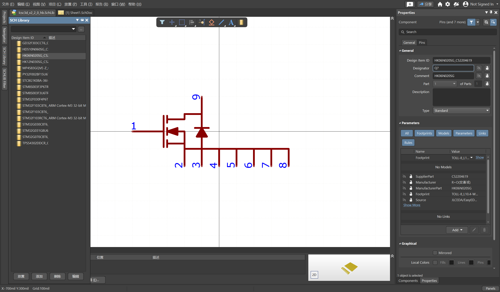</a> | <a href="docs/images/2.2.0/ad-footprint-user.png">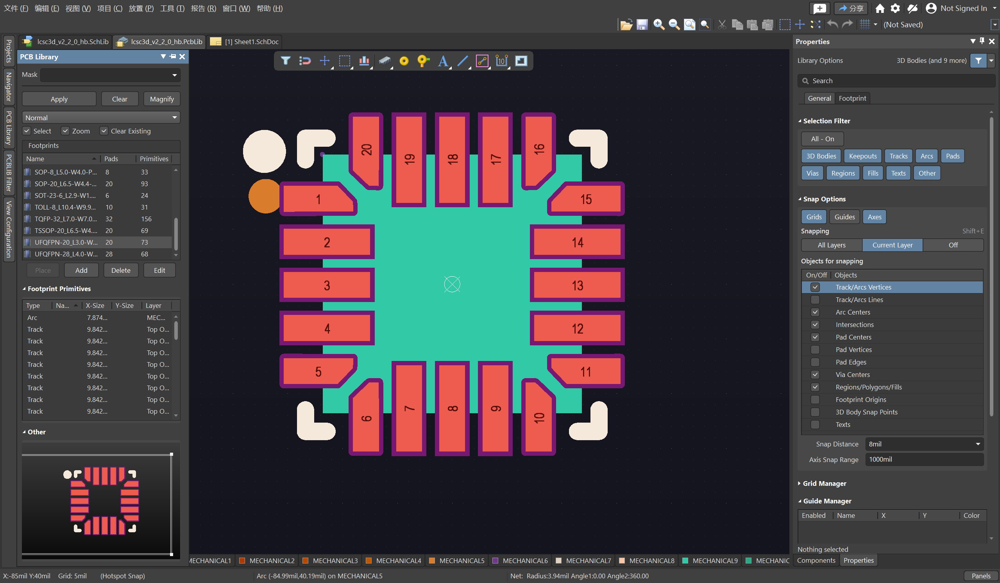</a> |

<a href="docs/images/2.2.0/ad-project-user.png">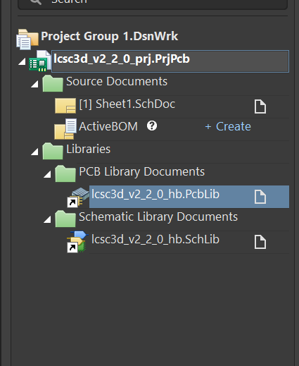</a>

<details>
<summary>更多既有 AD 实机示例：多单元符号、BGA、连接器和手动添加 STEP 后的三维效果</summary>

以下三维截图展示在 AD 中**另外添加 STEP 模型后**的效果；软件导出的 PcbLib 本身不自动包含这些模型。

**符号、封装与添加 STEP 后的三维效果 ↓↓↓**

| 多单元原理图符号 | BGA 封装 |
| --- | --- |
| <a href="docs/images/screenshots/4.png">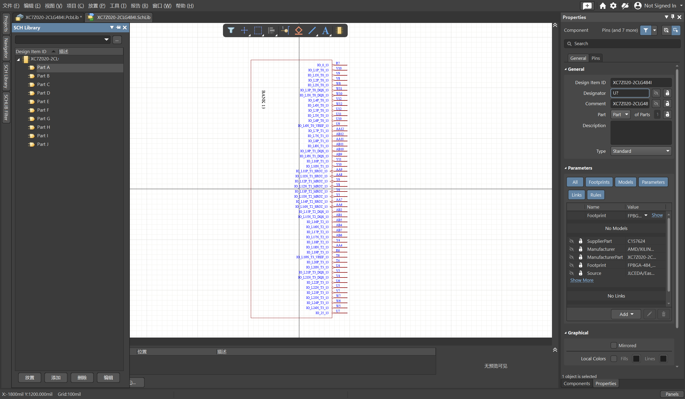</a> | <a href="docs/images/screenshots/5.png">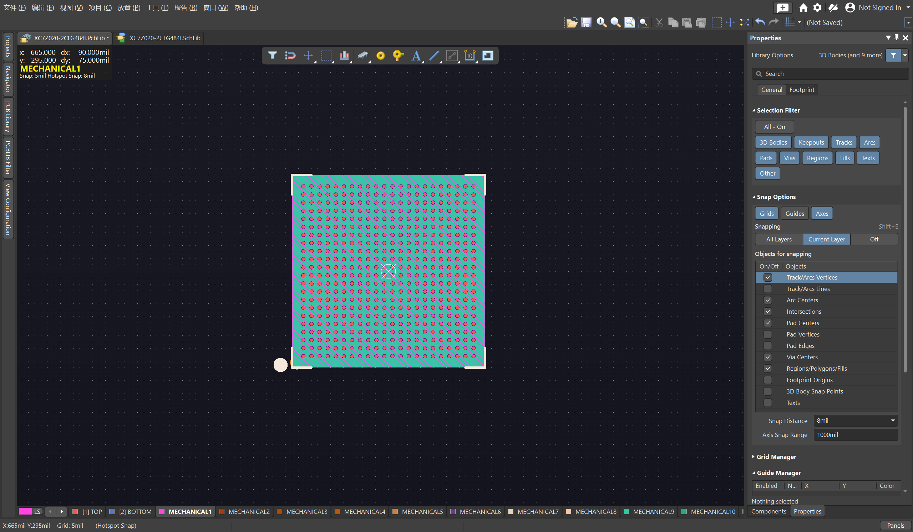</a> |

| 焊盘与铜区细节 | 异形焊盘示例 |
| --- | --- |
| <a href="docs/images/screenshots/6.png">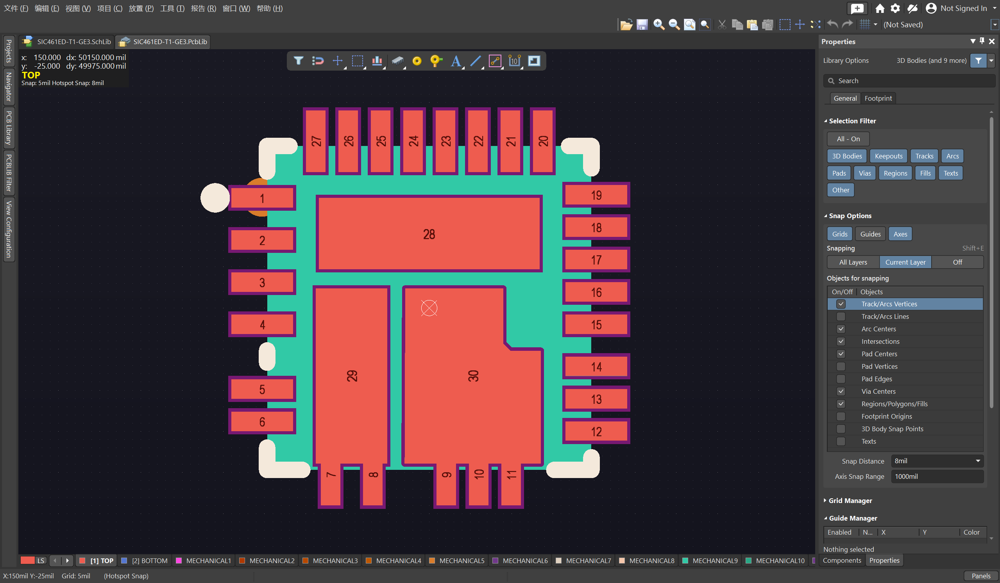</a> | <a href="docs/images/screenshots/7.png">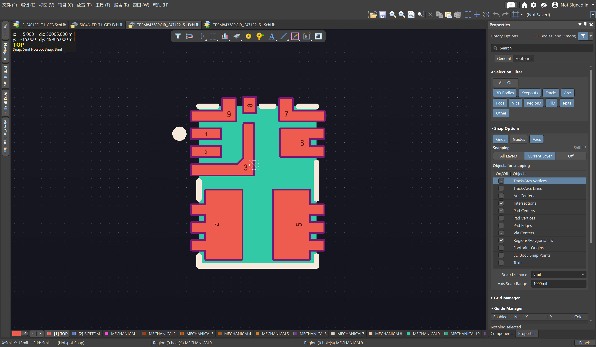</a> |

| 连接器二维封装 | 添加 STEP 后的 AD 三维视图 |
| --- | --- |
| <a href="docs/images/screenshots/8.png">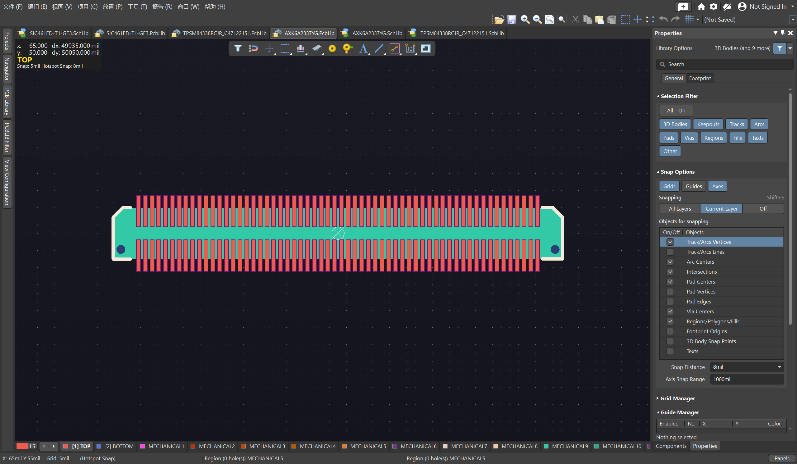</a> | <a href="docs/images/screenshots/9.png">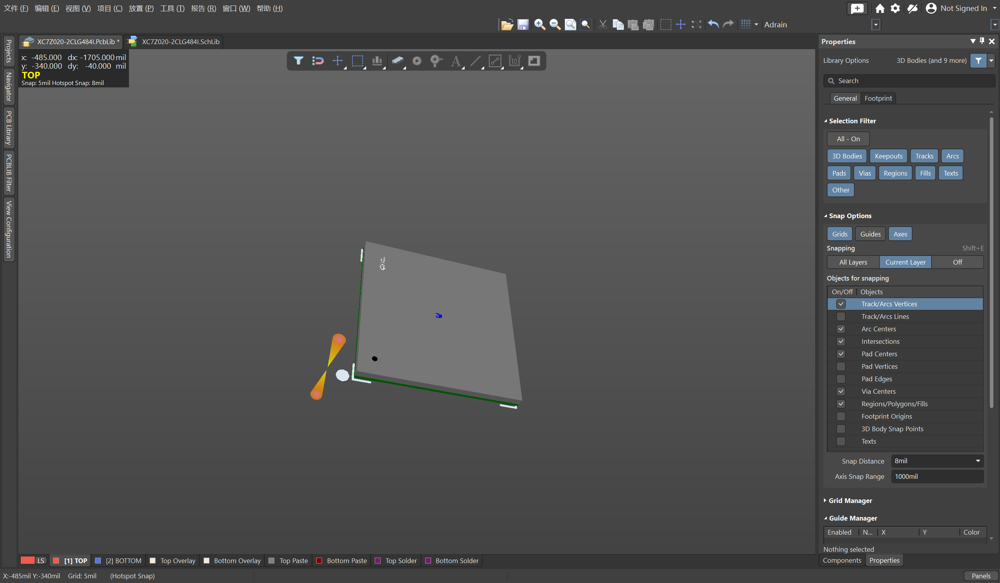</a> |

| 连接器三维视图 | 连接器另一侧视图 |
| --- | --- |
| <a href="docs/images/screenshots/10.png">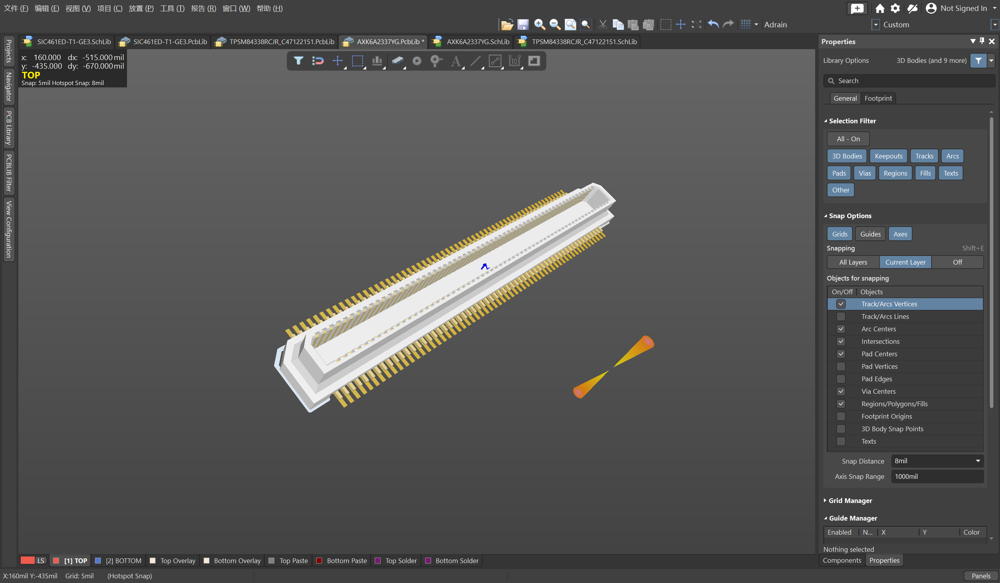</a> | <a href="docs/images/screenshots/11.png">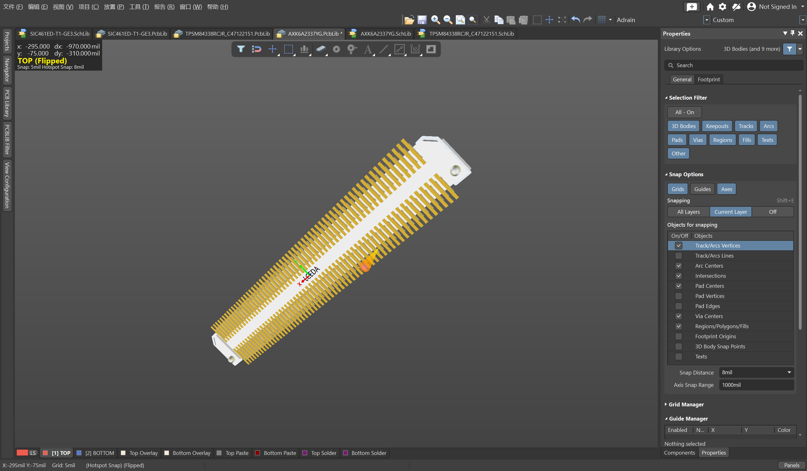</a> |

| Type-C 三维视图 | Type-C 底部视图 |
| --- | --- |
| <a href="docs/images/screenshots/12.png">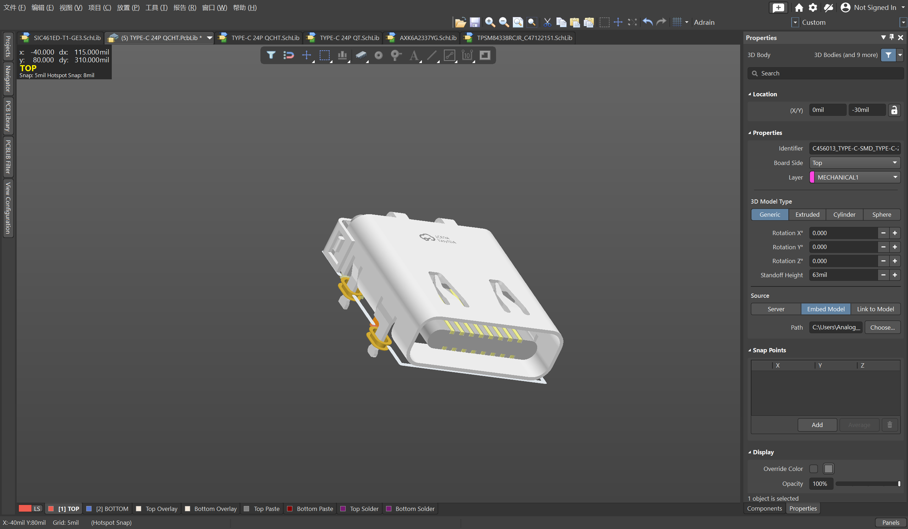</a> | <a href="docs/images/screenshots/13.png">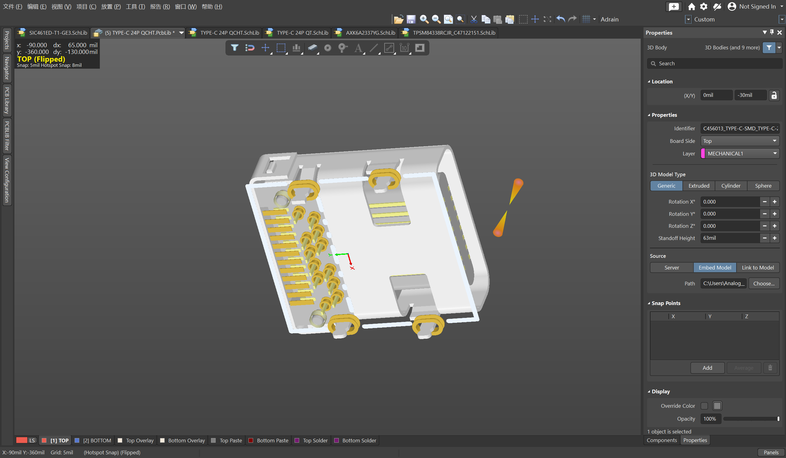</a> |

</details>

## 便携运行与自更新

程序以单个 `LCSC3D.exe` 交付，运行环境随 EXE 提供。设置保存在 `%LOCALAPPDATA%/LCSC3D/LCSC3D-settings.json`，保留下载目录和格式选择；日志、缓存及更新暂存也统一放在应用数据目录。

软件启动后自动在后台检查一次本仓库的最新正式版本，发现新版时弹出更新窗口；已是最新版、连接失败或接口异常时保持静默，失败信息记录到日志。也可点击“设置 → 关于与支持 → 检查更新”手动查询并查看结果。便携 EXE 支持后台下载、SHA-256 校验和“下载并重启”：校验通过后替换程序并启动新版，保留设置及已下载资源；替换或启动失败时恢复原程序。程序目录需要可写，下载模型时可检查版本，安装更新需等下载任务结束。

每个正式 Release 提供：

| 文件 | 内容 |
| --- | --- |
| `LCSC3D.exe` | Windows x64 便携程序。 |
| `LCSC3D.zip` | 完整应用源码、构建脚本、文档与许可证。 |
| `SHA256SUMS.txt` | 程序与源码包的 SHA-256 校验和。 |

## 使用范围与验证

下载及预览需要联网，3D 预览需要支持 WebGL 的显卡驱动。软件优先使用国内官方接口，失败时尝试官方镜像，并通过连接复用和受控并发处理批量任务。停止操作会在当前网络读取结束后响应。

部分元件没有关联的 3D 模型，仍可能有可用的符号与封装；某些模型格式也可能不可获取。导出结果以实际官方资源和软件提示为准。预览用于选型和检查，生产设计前仍需根据器件数据手册核对引脚、尺寸和封装。

当前版本通过 **447 项本地回归测试**，覆盖一体化窗口、主题与语言切换、备份与恢复、商城、导出和更新；已有专项继续覆盖 **136 组导出模式组合、16 组共享封装组合**及 **27 个官方 AD 对照样本**。实际 EXE 通过 Material 界面、设置与日志、备份、离线商城、导出五组自检，并用公开商品实网核对 3D、符号、封装、图片、国内搜索和国际站美元价格。EXE 模块、资源、Logo 与源码包逐项核对，截图及历史 AD 实测见 [验证记录](docs/验证记录.md)。

## 源码运行与构建

开发环境：Windows x64、Python 3.12。

```powershell
git clone https://github.com/Travelerrrrrr/LCSC3D.git
cd LCSC3D
python -m venv .venv
.\.venv\Scripts\python.exe -m pip install -r app/requirements-test.txt
.\.venv\Scripts\python.exe app/main.py
.\.venv\Scripts\python.exe -m unittest discover -s app/tests -v
```

运行 `app/build.ps1` 进行测试并构建，最新 EXE 自动同步到 `outputs/LCSC3D.exe`。构建与发行验证流程见 [贡献指南](CONTRIBUTING.md)。

不发布 GitHub 的完整更新测试：运行 `python scripts/local_update_test.py`，在隔离副本中操作实际更新窗口；追加 `--auto` 自动验证。详见 [本地更新测试](docs/本地更新测试.md)。

## 许可证与数据来源

项目代码采用 [AGPL-3.0-or-later](LICENSE)，依赖组件的许可证和声明见 [第三方声明](app/licenses/THIRD-PARTY.md)。

符号、封装和模型来自 [嘉立创EDA / JLCEDA 官方库](https://lceda.cn/) 与 [EasyEDA 官方库](https://easyeda.com/)。STEP / OBJ 保持官方内容，界面和库参数保留来源信息。软件许可证不替代元件数据自身的版权及使用条件。

欢迎通过 [Issues](https://github.com/Travelerrrrrr/LCSC3D/issues) 提交问题或建议。反馈导出问题时，请附上 C 编号、软件版本、所选格式、错误提示及对应截图，便于复现。
