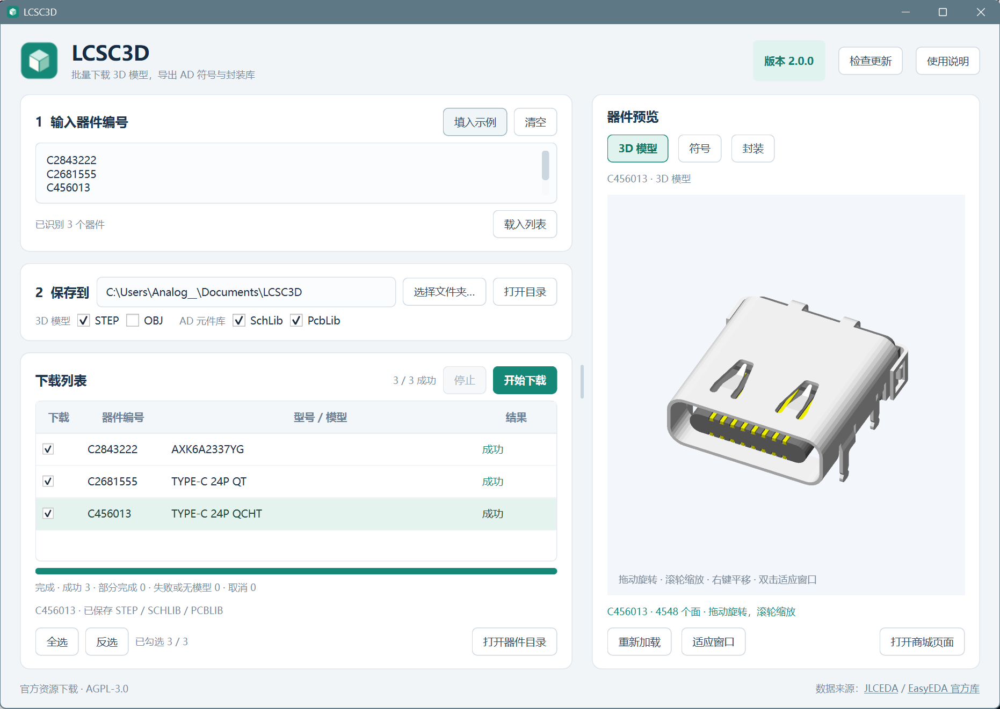
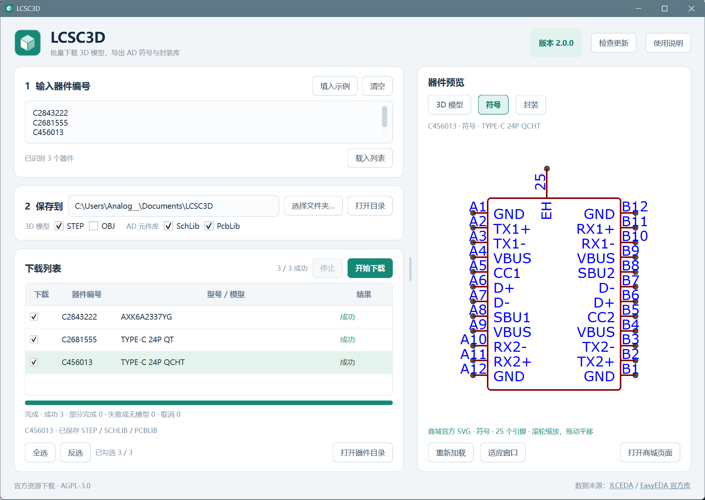
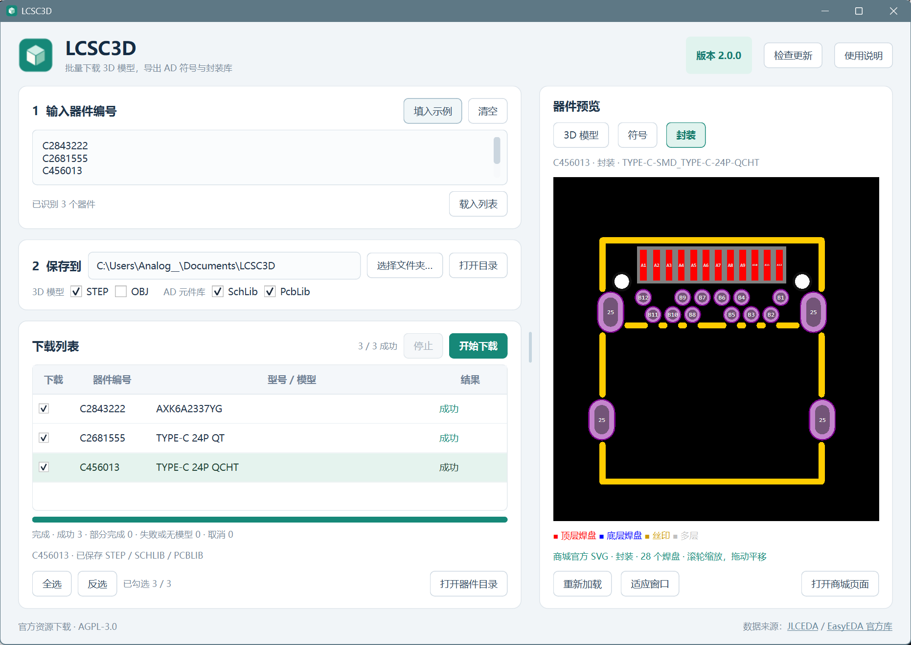

# LCSC3D：立创元件 3D 模型下载与 Altium Designer 元件库导出

[](https://github.com/Travelerrrrrr/LCSC3D/releases/latest)
[](https://github.com/Travelerrrrrr/LCSC3D/actions/workflows/windows.yml)
[](https://github.com/Travelerrrrrr/LCSC3D/releases/latest)
[](LICENSE)

**输入立创商城 C 编号，批量获取 STEP / OBJ 模型、导出 AD 符号库和封装库，并在同一个窗口预览元件。**

LCSC3D 是面向硬件开发、PCB 设计和结构配合的 Windows 便携工具。软件直接读取嘉立创官方元件资源，将型号查询、模型下载、Altium Designer 元件库导出和预览放在一起。下载 `LCSC3D.exe` 即可运行，无须安装 Python；导出 AD 库也无须在电脑上安装 Altium Designer。

Batch download LCSC STEP/OBJ models, export Altium Designer SchLib/PcbLib libraries, and preview electronic components on Windows.

**当前版本：2.0.0** · **[下载 Windows 程序](https://github.com/Travelerrrrrr/LCSC3D/releases/latest/download/LCSC3D.exe)** · [完整使用说明](app/README.md) · [版本记录](docs/releases/v2.0.0.md) · [问题反馈](https://github.com/Travelerrrrrr/LCSC3D/issues)



## 功能一览

| 功能 | 可以做什么 |
| --- | --- |
| 批量型号查询 | 输入多个 C 编号，自动查询元件型号，合并重复编号，逐项显示结果。 |
| STEP / OBJ 下载 | 获取官方 3D 模型，用于机械装配、结构空间检查或其他 3D 工作流程。 |
| AD 原理图库 | 生成原生 `.SchLib`，保留引脚名称、编号、电气类型和多单元结构。 |
| AD PCB 封装库 | 生成原生 `.PcbLib`，保留焊盘、钻孔、槽孔、铜区及封装图形。 |
| 三类资源预览 | 在 3D 模型、原理图符号和 PCB 封装之间切换，下载前即可查看。 |
| 下载选择 | 按器件勾选，支持全选、反选，可自由组合四种输出格式。 |
| 任务与文件管理 | 显示进度和逐项结果；可以停止任务、打开器件目录、重新获取同名文件。 |
| 便携与自更新 | 单个 EXE 直接运行，保存目录及格式设置自动记忆，支持检查更新、校验和重启更新。 |

## 原生 Altium Designer 元件库

### 原理图库 SchLib

勾选 `SchLib` 后，软件从官方元件结构数据生成 AD 原理图库。库中保留引脚的名称、真实编号、电气类型、方向及可见性，支持字母编号、组合编号和多单元符号，也保留文字、轮廓和来源参数。

多单元元件按各单元的原点及引脚归属导出。符号的 PCB 模型引用与封装库中的封装名称对应，方便在 AD 中配合使用。

### PCB 封装库 PcbLib

勾选 `PcbLib` 后，软件生成 AD PCB 封装库。支持常见贴片和通孔焊盘、矩形/圆形/椭圆焊盘，以及原始数据带有有效轮廓的多边形、自定义和凹形焊盘；保留孔径、槽长、旋转、铜孔偏移、镀孔状态及阻焊/锡膏扩展等信息。

遇到暂不支持的图元或多轮廓区域时，软件会提示该格式导出失败；同一任务中其他成功的资源仍会保存。没有关联 3D 模型的元件，也可以单独导出可用的符号库和封装库。

生成文件可在 Altium Designer 中打开或安装使用，当前不生成 IntLib。

### 3D 模型需要手动添加到 PcbLib

**当前导出的 PcbLib 不自动嵌入或绑定 3D 模型。** 如果需要在 AD 中显示三维封装，请同时下载 `STEP`，在 PcbLib 编辑器中添加 3D Body 并导入该 STEP 文件。导入后需根据焊盘与器件实际安装位置核对 **XYZ 位置、高度和旋转角度**，必要时手动调整角度与偏移。

原因是官方 3D 模型作为独立文件提供，其原点、坐标轴方向及摆放角度可能与 AD 封装库的坐标体系不同。当前导出尚未把官方封装中的 3D 关联、位置和旋转信息转换为 AD 3D Body 参数，因此直接导入模型后，朝向与高度不一定已经对齐。

**后续版本会增加 3D 模型自动嵌入 PcbLib 的功能，并完善模型与封装的关联、位置和角度处理。**

## STEP / OBJ 模型与三类预览

| 资源 | 用途 | 预览操作 |
| --- | --- | --- |
| 3D 模型 | 原样保存官方 STEP、OBJ。STEP 适合 SolidWorks、FreeCAD 等 CAD 软件；OBJ 可用于其他支持该格式的 3D 工具。 | 左键拖动旋转，滚轮缩放，右键拖动平移。 |
| 原理图符号 | 查看官方符号图形、引脚名称和编号；多单元元件可选择单元。 | 滚轮缩放，左键拖动平移。 |
| PCB 封装 | 查看焊盘、孔位、轮廓、编号和官方图层配色。 | 滚轮缩放，左键拖动平移。 |

载入列表后自动预览首个元件，单击其他行即可切换。三类预览都支持“适应窗口”和双击恢复视野，加载失败时可以“重新加载”，也可以直接打开商城页面。

3D 初始视角保持元件顶部朝上。切换器件和下载进度更新时，预览仍可操作；资源可以先查看，再决定需要保存哪些格式。

### 原理图符号预览

同一 Type-C 连接器的符号预览，可查看 A1～A12、B1～B12 等实际引脚编号。



### PCB 封装预览

同一元件的封装预览，可查看焊盘编号、固定孔、轮廓和图层颜色。



### 与立创商城官方页面对照

下图为相同 C456013 元件在立创商城中的符号、封装和 3D 模型，可与上面的软件截图对照查看。软件中的符号与封装预览使用官方图形，3D 预览读取官方模型。


## 批量下载与文件管理

- **灵活输入**：支持换行、空格、中英文逗号和分号，C 编号不区分大小写；重复编号自动合并。
- **先查询，再勾选**：载入列表后后台查询全部元件型号，下载只处理勾选的器件。全选、反选和当前预览行分别控制选择与查看。
- **自由组合格式**：`STEP`、`OBJ`、`SchLib`、`PcbLib` 可任意组合，也可仅导出 AD 库。
- **逐项反馈**：展示本次任务进度及成功、部分完成、无模型或失败等结果；一种格式失败时保留其他成功资源。
- **自动覆盖更新**：每次下载重新获取所选资源，覆盖已有同名文件。获取或生成成功后才替换，失败或取消时保留原文件。
- **停止与重试**：停止任务会保留已完成文件；重新下载需要更新的器件即可。
- **设置记忆**：保存目录和格式选项自动记忆，器件目录与商城页面可从软件中直接打开。

每个器件保存在独立的 **“元件型号_C编号”** 文件夹中。AD 库文件仅使用元件型号命名；STEP / OBJ 文件保留编号与模型名称。文件名中的 Windows 禁用字符会替换为下划线。

```text
所选保存目录/
└─ RP2040_C2040/
   ├─ RP2040.SchLib
   ├─ RP2040.PcbLib
   ├─ C2040_LQFN-56_L7.0-W7.0-P0.4-EP.step
   └─ C2040_LQFN-56_L7.0-W7.0-P0.4-EP.obj
```

## 开始使用

1. 从 [Releases](https://github.com/Travelerrrrrr/LCSC3D/releases/latest) 下载 `LCSC3D.exe`，在 Windows 10/11 x64 上直接运行。
2. 输入元件的立创 C 编号，例如 `C2040, C20197, C456013`，点击“载入列表”。
3. 单击器件行查看预览，勾选需要下载的器件；可使用“全选”或“反选”。
4. 选择保存目录和所需格式，点击“开始下载”。
5. 点击“打开器件目录”查看文件。在 AD 中打开或安装 SchLib / PcbLib；STEP / OBJ 可交给对应的 CAD 或 3D 工具使用。

## 在 Altium Designer 中查看

以下是提供的 AD 实机截图，展示多单元符号、BGA 封装、焊盘和连接器。三维截图展示的是在 AD 中**另外添加 STEP 模型后**的效果；软件导出的 PcbLib 本身不自动包含这些模型。

<details>
<summary>展开查看 10 张 AD 截图：符号、封装与添加 STEP 后的三维效果</summary>

| 多单元原理图符号 | BGA 封装 |
| --- | --- |
| <a href="docs/images/screenshots/4.png"></a> | <a href="docs/images/screenshots/5.png"></a> |

| 焊盘与铜区细节 | 异形焊盘示例 |
| --- | --- |
| <a href="docs/images/screenshots/6.png"></a> | <a href="docs/images/screenshots/7.png"></a> |

| 连接器二维封装 | 添加 STEP 后的 AD 三维视图 |
| --- | --- |
| <a href="docs/images/screenshots/8.png"></a> | <a href="docs/images/screenshots/9.png"></a> |

| 连接器三维视图 | 连接器另一侧视图 |
| --- | --- |
| <a href="docs/images/screenshots/10.png"></a> | <a href="docs/images/screenshots/11.png"></a> |

| Type-C 三维视图 | Type-C 底部视图 |
| --- | --- |
| <a href="docs/images/screenshots/12.png"></a> | <a href="docs/images/screenshots/13.png"></a> |

</details>

## 便携运行与自更新

程序以单个 `LCSC3D.exe` 交付，运行环境随 EXE 提供。设置保存在程序同目录的 `LCSC3D-settings.json` 中，便于保留下载目录和格式选择。

点击“检查更新”可查看本仓库的最新正式版本。便携 EXE 支持后台下载、SHA-256 校验和“下载并重启”：校验通过后替换程序并启动新版，保留设置及已下载资源；替换或启动失败时恢复原程序。程序目录需要可写，下载模型时可检查版本，安装更新需等下载任务结束。

每个正式 Release 提供：

| 文件 | 内容 |
| --- | --- |
| `LCSC3D.exe` | Windows x64 便携程序。 |
| `LCSC3D.zip` | 完整应用源码、构建脚本、文档与许可证。 |
| `SHA256SUMS.txt` | 程序与源码包的 SHA-256 校验和。 |

## 使用范围与验证

下载及预览需要联网，3D 预览需要支持 WebGL 的显卡驱动。软件优先使用国内官方接口，失败时尝试官方镜像，并通过连接复用和受控并发处理批量任务。停止操作会在当前网络读取结束后响应。

部分元件没有关联的 3D 模型，仍可能有可用的符号与封装；某些模型格式也可能不可获取。导出结果以实际官方资源和软件提示为准。预览用于选型和检查，生产设计前仍需根据器件数据手册核对引脚、尺寸和封装。

当前版本通过 **134 项本地回归测试**，AD 导出回归包含 **27 个官方样本**，覆盖多单元符号、BGA、字母编号、槽孔、铜孔偏移和自定义焊盘，并用独立读取器核对实际库记录。便携 EXE 已验证模型下载、三类预览、重复导出覆盖及窗口稳定性。详细范围与记录见 [验证记录](docs/验证记录.md)。

## 源码运行与构建

开发环境：Windows x64、Python 3.12。

```powershell
git clone https://github.com/Travelerrrrrr/LCSC3D.git
cd LCSC3D
python -m venv .venv
.\.venv\Scripts\python.exe -m pip install -r app/requirements-test.txt
.\.venv\Scripts\python.exe app/main.py
.\.venv\Scripts\python.exe -m unittest discover -s app/tests -v
```

运行 `app/build.ps1` 进行测试并生成 `app/dist/LCSC3D.exe`。构建与发行验证流程见 [贡献指南](CONTRIBUTING.md)。

## 许可证与数据来源

项目代码采用 [AGPL-3.0-or-later](LICENSE)，依赖组件的许可证和声明见 [第三方声明](app/licenses/THIRD-PARTY.md)。

符号、封装和模型来自 [嘉立创EDA / JLCEDA 官方库](https://lceda.cn/) 与 [EasyEDA 官方库](https://easyeda.com/)。STEP / OBJ 保持官方内容，界面和库参数保留来源信息。软件许可证不替代元件数据自身的版权及使用条件。

欢迎通过 [Issues](https://github.com/Travelerrrrrr/LCSC3D/issues) 提交问题或建议。反馈导出问题时，请附上 C 编号、软件版本、所选格式、错误提示及对应截图，便于复现。
