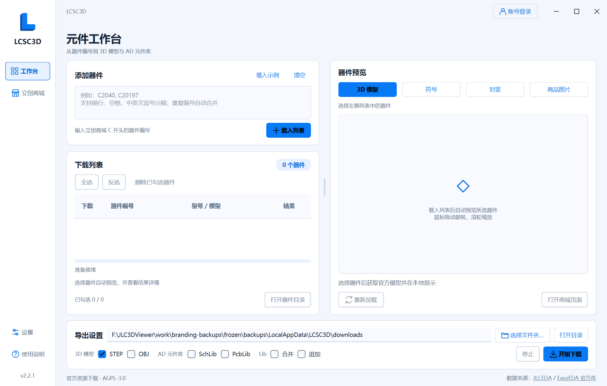
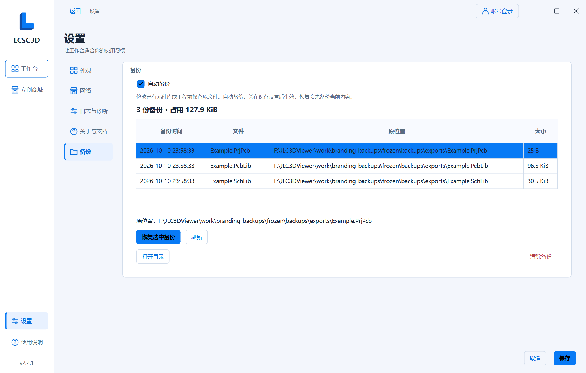
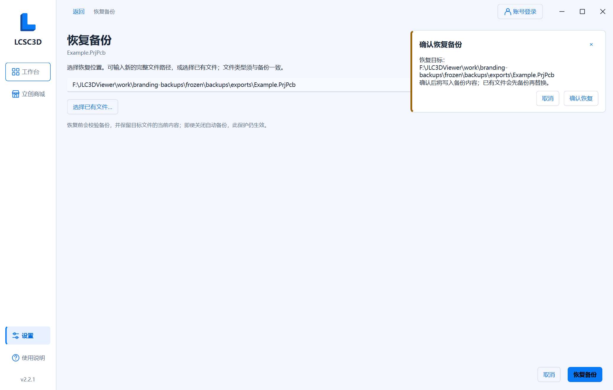

# Logo 与备份管理验证

2026-10-10 本地改动，源码版本 2.2.1。Windows x64、Python 3.12.10、PySide6 6.11.1。过程材料位于已忽略的 `work/branding-backups/`，所有自动化使用隔离的 `LOCALAPPDATA` 和测试文件，不读取或修改用户真实登录会话、元件库或备份。

## 实现

- 保留用户提供的 Logo 原始 SVG、PNG 和 ICO。侧栏使用矢量 L 图标，关于页按明暗模式切换横版字标，应用与 Windows EXE 使用新 ICO。资源生成脚本同步提供的素材，不再生成旧立方体图标。
- 新用户默认浅色、品牌蓝 `#087AF5`，浅色背景和正文颜色与字标配色一致。已保存的自选配色、明暗模式和字体继续沿用。
- 设置新增 **备份** 页和备份分组，显示自动备份开关、数量、磁盘占用、文件列表、原路径、恢复、刷新、打开目录和清理入口。开关遵守设置的保存/取消语义。
- 新备份记录原路径、时间、大小及 SHA-256，兼容旧版无元信息的平铺副本。恢复支持原位置、指定已有文件和新文件路径，覆盖前总是保留当前文件，即使自动备份关闭。
- 恢复前校验备份并核对确认时的目标内容；清除只作用于确认列表中的受管理备份，不删除原库、工程或新产生的备份。恢复和清理在后台执行，与导出互斥。

## 回归与界面检查

- 全量 **447 项测试通过**，含新增的 16 项备份与管理界面测试。配置迁移测试同步核对新的 `auto_backup` 字段。
- 覆盖自动备份关闭后的文件冲突保护、原路径和空间统计、两种库与工程恢复、恢复前保护副本、旧版兼容、恢复到新路径、相同内容跳过、损坏校验、确认后目标变化、写入失败、取消、部分清理失败可重试及清理后继续备份。
- 源码运行的 Material、设置、备份三组自检通过。截图检查浅色默认工作台、明暗备份页、关于页字标、恢复及清理确认、1060×740 / 24px 英文界面。大字号下可滚动，窗口按钮和备份操作保持可用。
- 截图自检在通知滑入动画完成后捕获，恢复和清理必须点击各自的确认按钮才执行。损坏记录禁止恢复，仍可清理。

## 成品核对

最新入口为 `outputs/LCSC3D.exe`。EXE 模块与资源、源码 ZIP 和成品校验记录随本次交付同步。Windows 图标资源逐帧核对提供的 ICO，覆盖 16、24、32、48、64、128、256 px。

- 实际 EXE 的 Material、设置、备份、离线商城和导出 **五组自检全部通过**；包含 26 张 Material 截图和 7 张备份流程截图。
- EXE 内 44 个应用模块与 33 个资源文件逐一匹配工作区，PNG/ICO 入口及品牌源素材与提供的 Logo 文件一致。
- 自检工作目录与 EXE 目录未新增配置、日志或缓存；成品 EXE、源码 ZIP、使用说明、验证记录及 SHA-256 校验和同步到 `outputs/` 和 `outputs/v2.2.1/`。

操作方法见 [使用说明：备份与恢复](../app/README.md#备份与恢复)。
