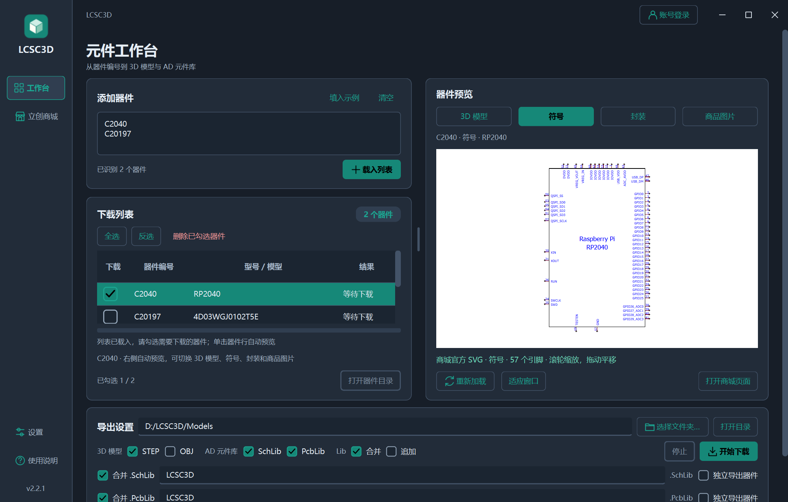
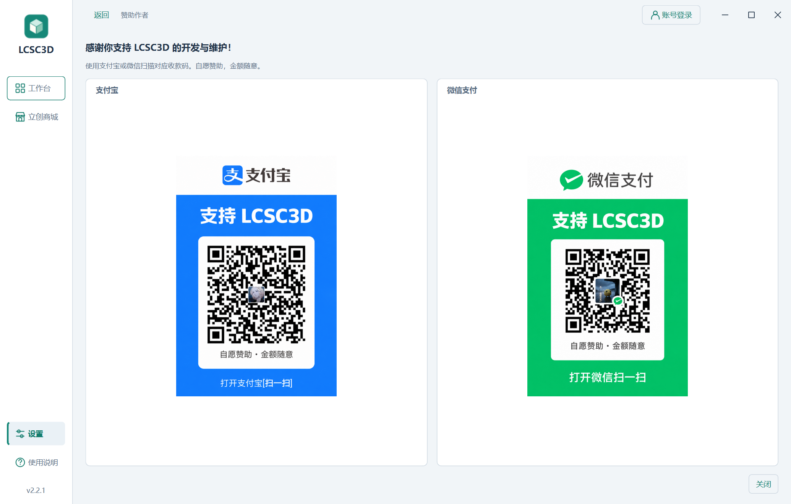
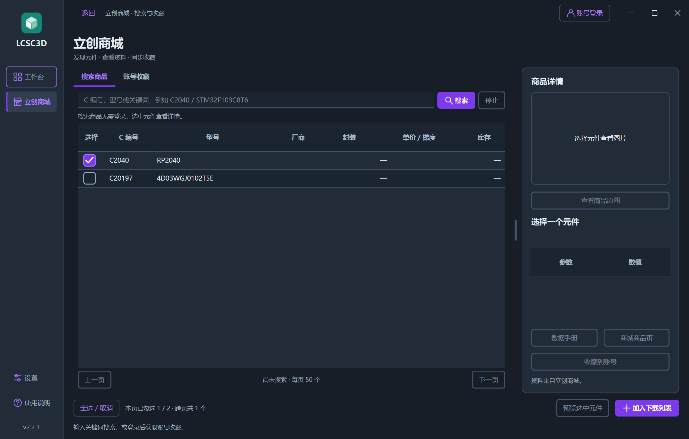
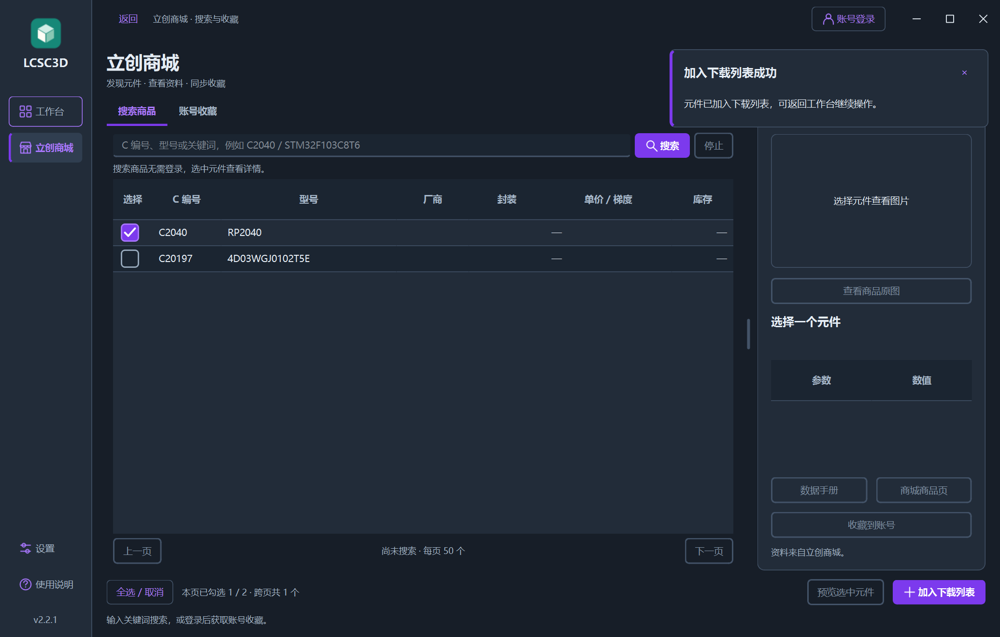
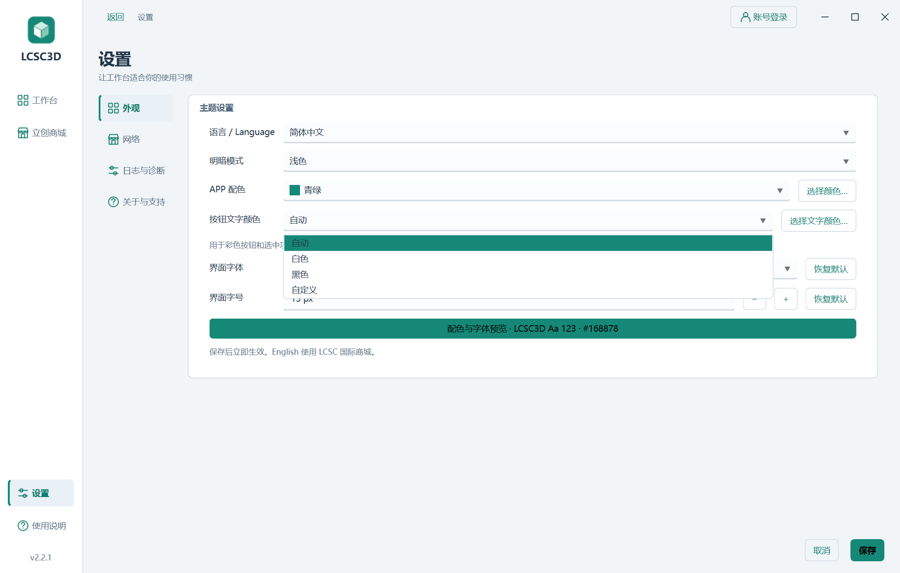
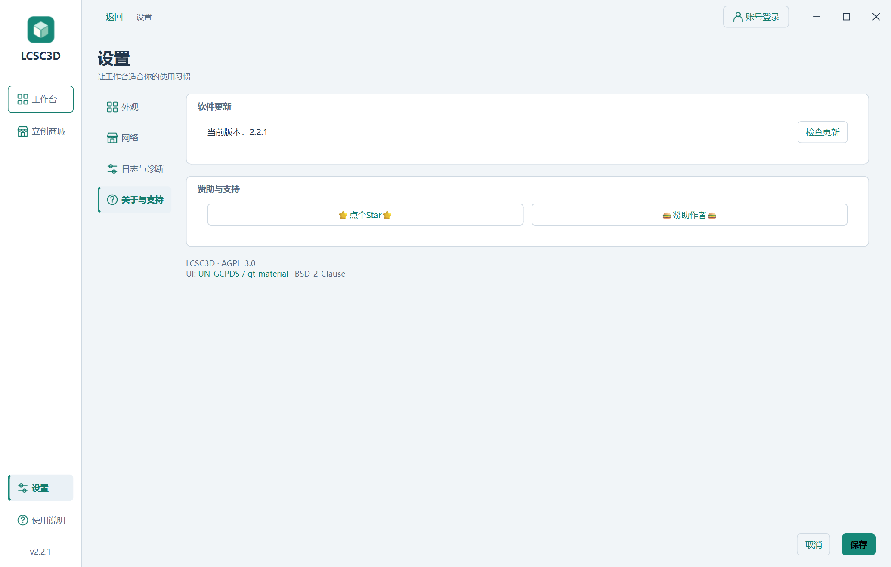
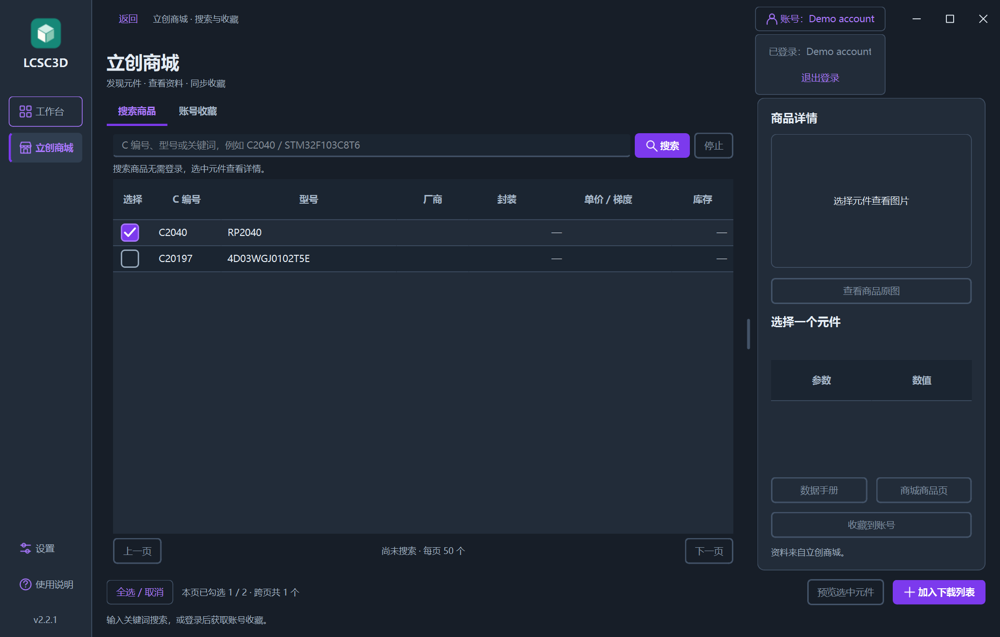

# Material UI 与单窗口布局验证

日期：2026-10-10。源码版本：2.2.1。本地 Windows x64，Python 3.12.10、PySide6 6.11.1、qt-material 2.17；截图桌面缩放 150%。本次为本地构建，未推送、打标签或发布 Release。

## 本次界面调整

| 用户反馈 | 实现 |
| --- | --- |
| 去掉上方系统标题栏，界面融为一体 | 窗口按钮嵌入账号入口右侧，与应用主题一致；顶部空白处拖动、双击最大化/还原，边角保留原生缩放。通知避开顶部操作栏。 |
| 保持一个界面 | 设置、商城、登录、图库、赞助、库追加、更新、帮助、颜色与文件选择均作为主窗口内页面；侧栏和账号入口持续可用。 |
| 提醒从右上角滑入 | 导入结果、启动更新提醒、清除日志确认使用主窗口内通知，从右侧向左滑入；确认操作须点击对应按钮。 |
| 勾选框黑框与边缘不平滑 | 以完整圆角 SVG 绘制各状态，避免原生边框与勾号图片叠加；覆盖表格、选择行、普通复选框及禁用状态。 |
| 账号菜单宽度不一 | 菜单贴齐账号按钮，每行使用相同宽度；账号名称变化后重新定位。 |
| 分组标题位置 | 按最终要求统一放在框内左上角；标题透明，边框完整，内容下移以留出标题空间。设置和支付宝/微信收款码分组使用相同样式。 |
| 商城左右比例调节样式不一致 | 商城与工作台共用圆角拖动分隔条。 |
| 下拉框随机位置 | 下拉列表从控件下方展开，与控件等宽，最多八项，支持滚动、键盘选择与 Esc 取消；文件选择页内的下拉框也在主窗口内显示。 |
| 商城顶部白条 | 关闭原生页签基线，使用统一的 Material 选中下划线。 |
| 支持按钮文案被修改 | 恢复“⭐点个Star⭐”与“🍔赞助作者🍔”。 |

界面继续使用 [UN-GCPDS/qt-material](https://github.com/UN-GCPDS/qt-material) 的模板及 SVG 控件资源。页面与通知组件位于 `app/shell_ui.py`，共用分隔条位于 `app/ui_components.py`，覆盖样式位于 `app/assets/material-overrides.qss`。主题和勾选框缓存仅生成在 `%LOCALAPPDATA%/LCSC3D/cache/`。

侧栏切换保留下载队列、勾选、商城搜索与未保存设置；设置中的保存、取消和返回遵守原有保存语义。预览商城元件切回工作台，重新进入商城保留选择。后台更新检查仅发送通知，点击通知后进入更新页；重复打开复用当前更新任务。

## 一体化标题栏（最新本地构建）

移除单独的系统标题栏，把最小化、最大化/还原和关闭并入应用顶部。Windows 原生窗口样式保留移动、缩放和系统菜单；命中测试区分物理屏幕坐标与 Qt 逻辑坐标，最大化客户区限定在当前显示器工作区。窗口关闭继续使用原有后台任务取消与设置保存流程。按钮使用矢量线条绘制，跟随明暗主题，支持中英文提示；提示消息从顶部栏下方滑入。

- `app/build.ps1`：431 项本地回归通过，包含 6 项新增窗口测试。另在相当于 100% / 150% / 200% 的 Qt 缩放设置下各运行这 6 项，全部通过。
- 原生测试实际核对客户区与窗口矩形一致、最大化客户区等于显示器工作区、八个边角缩放命中、拖动区与账号/返回/窗口按钮分离、还原尺寸和句柄不变、关闭事件可延迟，以及通知不遮挡窗口按钮。
- 在 Windows 桌面以实际鼠标操作确认顶部拖动、双击最大化、最大化拖回、边缘缩放与关闭。200% 的尺寸还原回归使用能容纳在屏幕工作区内的初始窗口，避免操作系统对超屏窗口的自动约束干扰结果。
- 完整回归中发现并修正通知随主窗口销毁时的控件释放顺序问题；顶部栏先销毁后不再访问其坐标。原生外框对象由主窗口持有，销毁时自动解除主题信号连接。
- 最新 EXE 的 Material、设置和离线商城三组自检全部通过；Material 输出 25 张截图，验证最大化工作区、最小化/还原、句柄与尺寸保留和通知位置。三组运行的工作目录及 EXE 目录没有新增配置、缓存或日志。
- EXE 内全部应用模块及资源与当前源码一致，源码 ZIP 逐文件核对；`outputs/` 与 `outputs/v2.2.1/` 同步 EXE、源码包、使用说明、验证记录及校验和。

过程材料位于已忽略的 `work/frameless-verification/`。验证使用隔离的 `LOCALAPPDATA`，不读取真实登录会话。



## 框内标题调整（上一轮）

按最终要求，把主题、代理、日志、更新、赞助与两种收款码的标题统一移入框内左上角。标题使用透明背景，保留完整边框；内容区域预留标题高度，随字号调整。

- 构建前检查浅色/深色、微软雅黑 UI/Cascadia Code、12/13/24px、100%/150%/200% 缩放，共 108 个标题场景。实际像素与位置检查确认标题位于框内、背景色一致、内容不重叠，并检查设置和赞助页截图。
- `app/build.ps1` 的 425 项回归全部通过，重新生成 `outputs/LCSC3D.exe`。
- 最新 EXE 的 Material 界面和设置自检均通过，覆盖设置各页、收款码、字体、明暗主题、保存/取消与日志操作。验证采用隔离 AppData，未读取真实登录信息。
- EXE 内全部应用模块、资源与当前工作区一致；源码 ZIP 逐文件核对，根目录与 `outputs/v2.2.1/` 的五项交付文件同步。

本轮过程材料位于已忽略的 `work/group-titles/`；下方界面截图中的设置、下拉与赞助页已更新为本次 EXE 截图。



## 单窗口重构综合验证（上一轮）

- `app/build.ps1`：425 项回归全部通过，包括新增的八项单窗口与控件回归。测试使用隔离的 `LOCALAPPDATA` 和临时目录。实际渲染检查覆盖紫色勾选框、明暗配色、不同字号与选中/禁用状态。
- `--self-test-material`：正式 EXE 生成 24 张截图，每次捕获前均确认只有一个可见主窗口、没有活动模态窗口。检查设置、登录、图库入口、支持、颜色/文件选择、库追加、帮助、下拉框、账号菜单和通知。默认 1380×880 工作台完整显示常用操作；1060×740 与 24px 英文字号下操作可滚动访问，符号与封装达到 ready。
- `--self-test-settings`：正式 EXE 验证字体下拉、嵌入式颜色选择、保存/恢复/取消、语言与主题切换、赞助图片、日志过滤和打包；清除通知的取消/确认分支以及清除后继续记录和崩溃捕获均通过。字体列表最多八项，行高随字体增大。
- `--self-test-favorites`：正式 EXE 使用本机模拟服务验证搜索、50 条分页、跨页勾选、价格梯度、长文字、三张原图和缩放、三种登录、图片验证码、会话保存/恢复/退出、收藏与导入通知。商城预览切换工作台后，返回仍保留当前商品与选择。
- `--self-test-export`：正式 EXE 执行 13 个离线导出流程，覆盖合并、追加、单/双库、独立导出、PCB 工程、空列表导入和共享封装。
- 四组 EXE 自检均退出 0、`success=true`；仅保留 Windows 系统 PATH 运行，启动工作目录没有新文件。未读取用户真实登录凭据，登录和短信仅使用本机模拟服务。
- 本机更新服务验证：启动通知 → 查看更新 → 下载并重启 → 替换副本并确认新进程，通过；手动检查更新遇到错误 SHA-256 时，在更新页显示失败并保留原 EXE。使用隔离副本，未修改正式发布或根目录交付文件。
- `scripts/verify_app_data.py`：全新配置和旧配置迁移两个普通启动场景均退出 0；EXE 目录清洁，配置、日志及运行时解压均在隔离 AppData 下。
- `scripts/verify_bundle.py`：逐个比较全部应用模块及本地资源/许可证与工作区源码；检查 Qt Material 依赖、模板与 SVG 已打包，并逐文件比较源码 ZIP。

过程材料保存在已忽略的 `work/single-window/`，全量构建记录为 `work/single-window-build.txt`。本次使用本机模拟服务和已有官方离线样本，没有把它当作真实商城账号、实时价格或 Altium Designer 实机操作验证；旧版业务验证记录保留在 [验证记录](验证记录.md)。

## 正式 EXE 截图












## 本地交付

固定入口为 `outputs/LCSC3D.exe`，与 `outputs/v2.2.1/` 同步 EXE、源码 ZIP、使用说明、验证记录及 SHA-256 校验和。可重复核验：

```powershell
app/.venv/Scripts/python.exe scripts/verify_bundle.py --exe outputs/LCSC3D.exe --source-zip outputs/LCSC3D.zip
```
