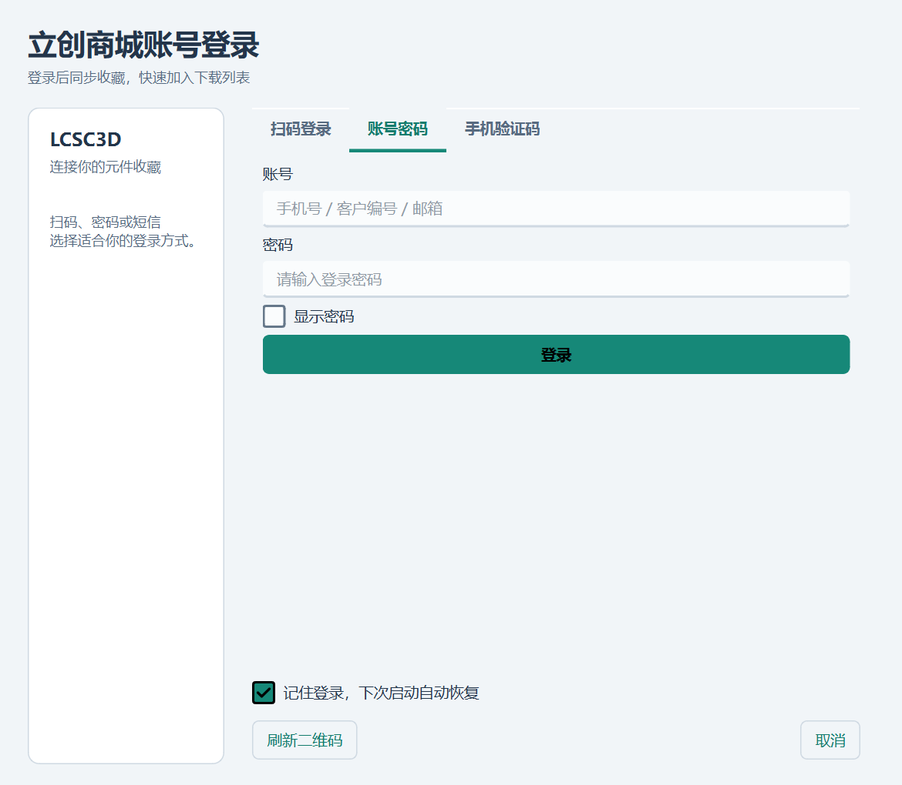
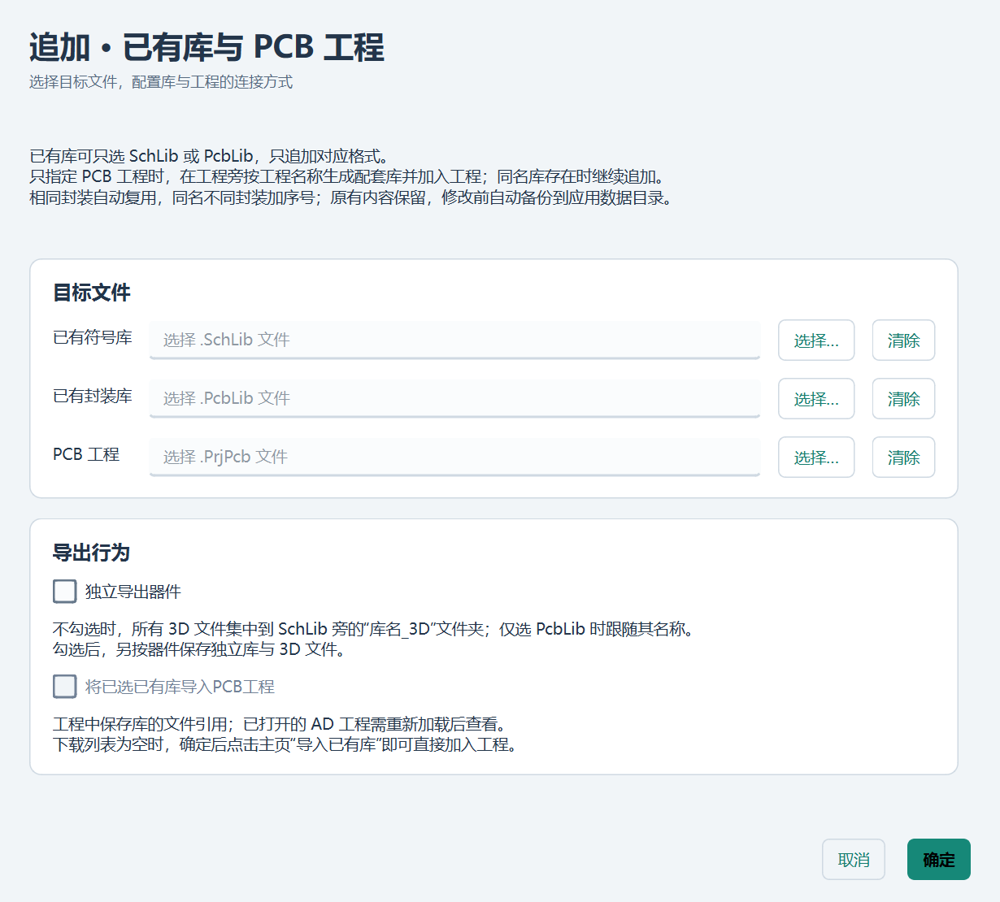

# Material UI 重构验证

日期：2026-10-10。源码版本：2.2.1。本地 Windows x64，Python 3.12.10、PySide6 6.11.1、qt-material 2.17；桌面缩放 150%。本次没有推送、打标签或发布 Release。

## 界面与实现

- 应用级样式使用 [UN-GCPDS/qt-material](https://github.com/UN-GCPDS/qt-material) 的模板及 SVG 控件资源；统一的应用覆盖样式、图标和容器分别在 `app/assets/material-overrides.qss`、`app/ui_components.py` 中。
- 工作台改为左侧导航、列表与预览并排、底部导出设置；设置按四个类别切换，商城、登录、图片浏览、库追加、更新、帮助和支持窗口统一样式。
- 主题图标按配置生成到 `%LOCALAPPDATA%/LCSC3D/cache/qt-material-2.17/`，生成时使用独立暂存目录再提交，缓存复用不改写已有图标。打包仅包含实际使用的模板和 SVG，不携带上游示例窗口、字体或 Python 缓存。
- 明暗主题、自定义文字颜色、字体/字号、语言、原有队列与导出配置保持兼容。官方符号、封装图形保持原色。

## 验证结果

- `app/build.ps1`：417 项回归通过。测试在 `work/build-verification/` 的隔离 `LOCALAPPDATA` 和临时目录中运行。最后的缩略图栏宽度调整另通过图片预览 6 项、画廊加载与导航 2 项定向回归。
- `--self-test-material`：真实 EXE 离线运行，15 张窗口截图；默认 1380×880 不需滚动即可看到导出区，1060×740 和 24px 英文字号下按钮可滚动访问。设置分类切换、明暗/中英文切换保留勾选，官方 C2040 样本的符号与封装画布达到 ready。
- `--self-test-settings`：真实 EXE 验证字体弹出框、配色选择器、保存/恢复/取消、日志过滤、打包诊断 ZIP，以及清除后继续记录和崩溃捕获。字体列表 293 项、弹出高度 194 个逻辑像素。分类导航后操作支持及日志按钮。
- `--self-test-favorites`：真实 EXE 使用本机模拟服务验证搜索、50 条分页、跨页勾选、价格梯度、长文字与参数、三张原图及缩放、三种登录、图片验证码、会话保存/恢复/退出、收藏操作、导入提示及队列删除。
- `--self-test-export`：真实 EXE 执行 13 个离线导出流程，覆盖合并、追加、单/双库、独立导出、PCB 工程、空列表导入和共享封装。
- 四组 EXE 自检均退出 0，报告 `success=true`，仅保留 Windows 系统 PATH 运行；启动工作目录没有新生成文件。未读取用户真实登录凭据，未发送真实短信或账号登录请求。
- `scripts/verify_app_data.py`：全新配置和旧配置迁移两个普通启动场景均退出 0；EXE 目录清洁，配置、日志及运行时解压均在隔离 AppData 下。
- `scripts/verify_bundle.py`：逐个比较 38 个应用模块及 24 个本地资源/许可证与工作区源码，核对 Qt Material、Jinja2、MarkupSafe、模板及 SVG 均已打包；源码 ZIP 逐文件比较，校验和随成品生成。

本次联网业务由本机模拟服务和已有官方离线样本覆盖；没有把它当作真实商城账号、实时价格或 Altium Designer 实机操作验证。旧版联网与 AD 验证记录继续保留在 [验证记录](验证记录.md) 中。

## 界面截图

以下截图来自本次构建的实际 EXE，符号使用公开官方样本，登录表单为空。完整过程材料保存在已忽略的 `work/material-validation/`。






## 本地交付

根目录交付入口为 `outputs/LCSC3D.exe`，与 `outputs/v2.2.1/` 同步 EXE、`LCSC3D.zip`、使用说明、验证记录及 SHA-256 校验和。可重复核验：

```powershell
app/.venv/Scripts/python.exe scripts/verify_bundle.py --exe outputs/LCSC3D.exe --source-zip outputs/LCSC3D.zip
```
