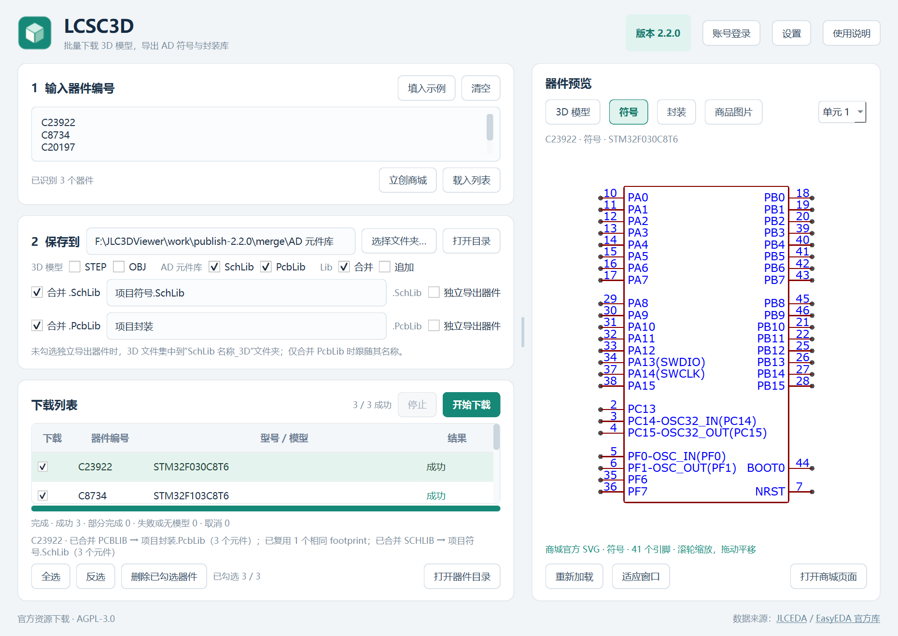
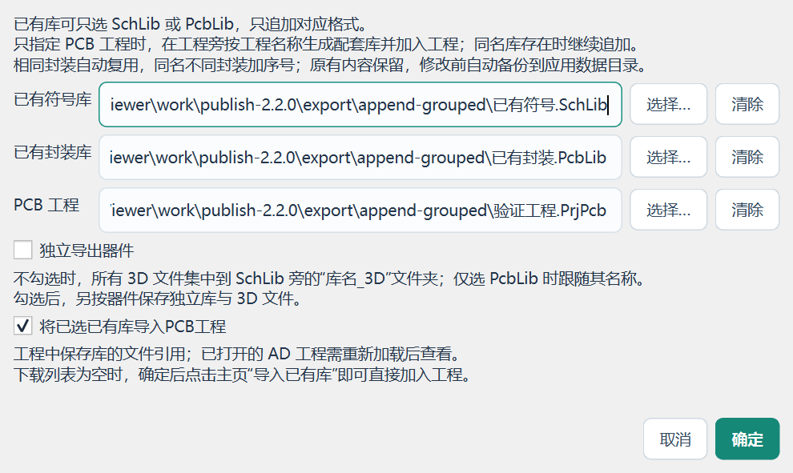
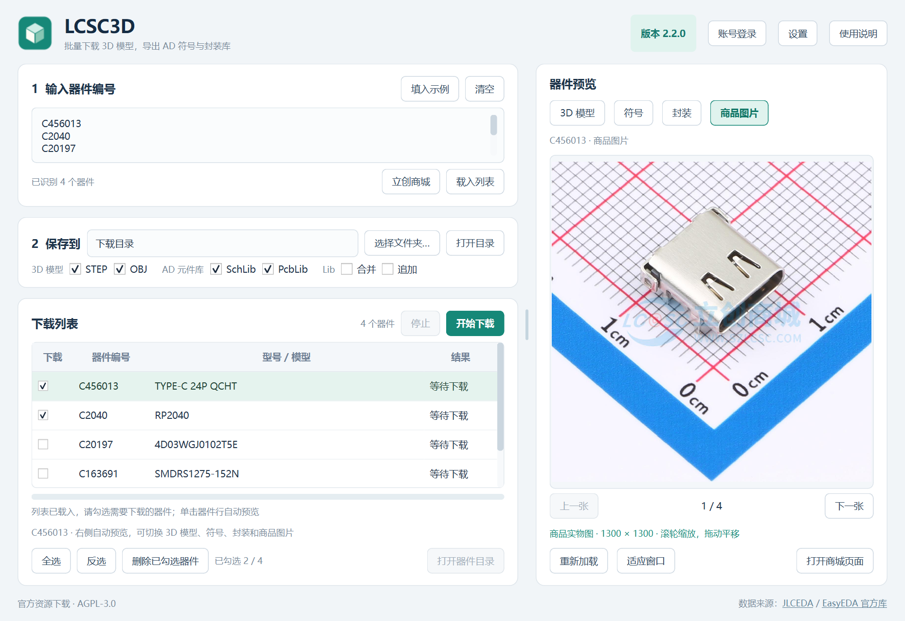

# LCSC3D 2.2.0

发布日期：2026-10-10 · Windows 10 / 11 x64 · 下载 EXE 即可运行

这次更新重点解决批量下载之后的元件库整理：合并或追加 SchLib / PcbLib、复用相同封装、将库加入 PCB 工程，并统一整理 3D 文件。以下包含自上一正式版本 2.1.1 以来的新增功能与修复。

## Lib 合并、追加与工程联动

- 主窗口新增 **Lib → 合并 / 追加**，两个模式互斥，勾选后才显示对应配置，替代原“库与工程…”入口。
- SchLib 与 PcbLib 可分别合并，并自定义库名。“同时单独输出”更名为 **独立导出器件**，可在合并或追加时额外保留逐器件库与模型。
- 支持只指定已有 SchLib 或 PcbLib，仅追加对应资源；选择追加时，“保存到”路径禁用，位置跟随库或工程。
- 同时选择已有库与 `.PrjPcb` 后，可勾选 **将已选已有库导入PCB工程**；只指定工程时，在工程旁创建或追加配套库。
- **下载列表为空也能直接导入已有库**，无需先下载器件。
- 修改已有库和工程前自动备份，保留原有内容；检测写入期间的外部修改，避免覆盖其他操作。

## 封装复用、文件命名与兼容修复

- **相同 footprint 自动复用**：排除随机标识及供应商元数据差异后，比较实际封装内容，避免合并、追加时重复新增等价封装；符号中的模型引用、Footprint 参数和独立导出的配套库同步更新。
- 同名但焊盘、图元或其他有效数据不同的封装使用序号区分。原库条目、原名称和历史重复项保持原样。
- 未勾选独立导出时，STEP / OBJ 集中到库旁的 **库名_3D** 文件夹，优先跟随 SchLib，仅有 PcbLib 时跟随 PcbLib。旧文件和目录保留。
- 导出的 Lib 文件及新库内名称不再自动添加 C 编号；独立器件文件夹仍使用 **型号_C编号**，便于区分。
- 修复 C23922 等元件导出 SchLib 时的 **“EDA 图元颜色不受支持：NONE”**。兼容无填充标记的大小写与空白写法，保留非法颜色校验。

实网验证中，C23922 / STM32F030C8T6 与 C8734 / STM32F103C8T6 共用一份 LQFP-48 封装；加入 C20197 后，合并库包含 **3 个符号、2 个 footprint**。C23922 的 48 个引脚与两个符号单元均保留。

## 预览、操作反馈与日志

- 主页新增 **商品图片** 预览，支持多图切换、缩放、拖动和重新加载。
- 商城 **加入下载列表** 后显示导入结果，方便确认加入数量。
- 手动 **检查更新** 移至设置窗口，启动时后台检查继续保留。
- 补充导出规划、集中模型目录、库提交、封装复用及空列表工程导入的诊断日志。配置、日志、缓存及更新暂存统一位于 AppData。

## Altium Designer 实测与验证

本次首页新增用户提供的 AD 实测截图：SchLib 符号、PcbLib 封装，以及工程中的两类库引用。截图采用用户测试库中的名称，追加操作会保留已有名称。

- **387 项本地回归通过**，包含 27 个官方 AD 对照样本。
- **136 组导出模式组合 + 16 组共享封装组合**，覆盖单库/双库、独立导出、STEP/OBJ、工程联动及重复追加。
- 正式 EXE 完成 **13 个导出窗口流程**，另验证实网 C23922、共享封装合并、模型下载与预览、设置日志及自更新。
- EXE 内模块与源码逐项比较，源码 ZIP 内容与工作区一致。完整范围见 [验证记录](../验证记录.md)。

当前 PcbLib 不自动嵌入或绑定 3D 模型；需要三维封装时，在 AD 中手动添加下载的 STEP，并核对位置与角度。

## 下载与更新

- `LCSC3D.exe`：Windows x64 便携程序。
- `LCSC3D.zip`：完整应用源码、构建脚本、文档与许可证。
- `SHA256SUMS.txt`：EXE 与源码包的 SHA-256 校验和。

已有版本可通过软件的检查更新入口升级，也可下载 EXE 替换旧程序。设置与已经导出的资源保留。详细操作见 [使用说明](../../app/README.md)。
