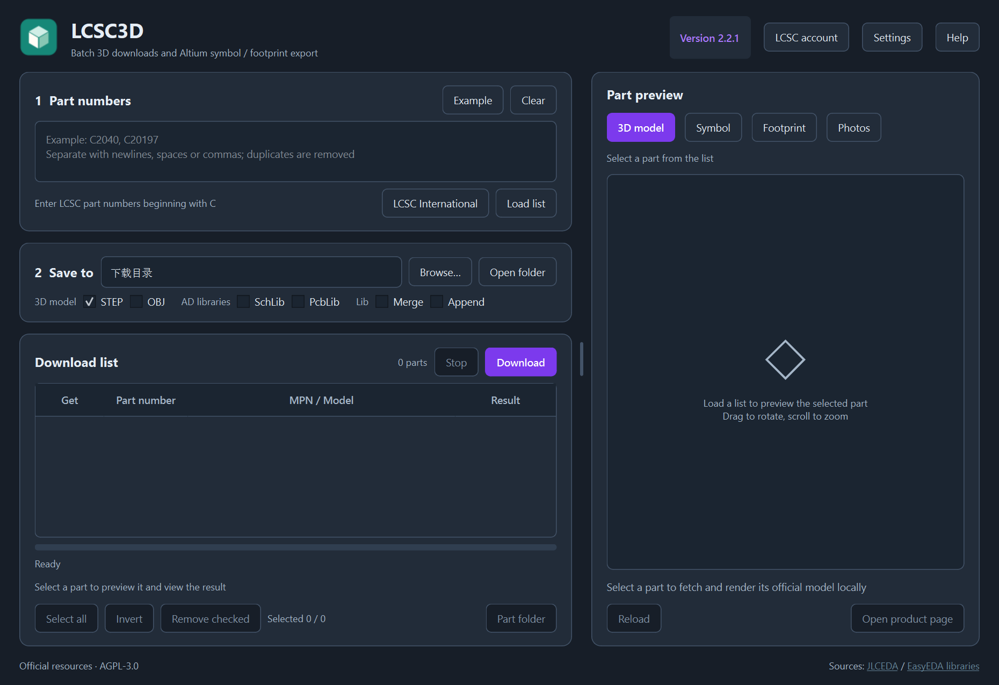
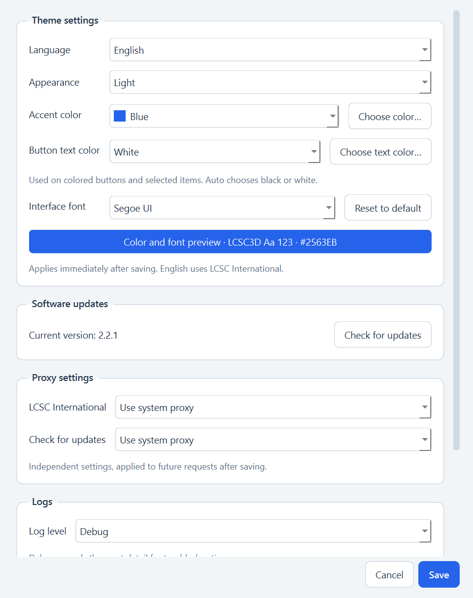
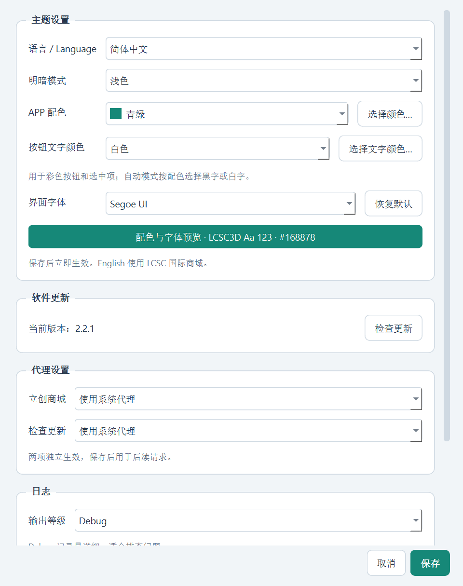
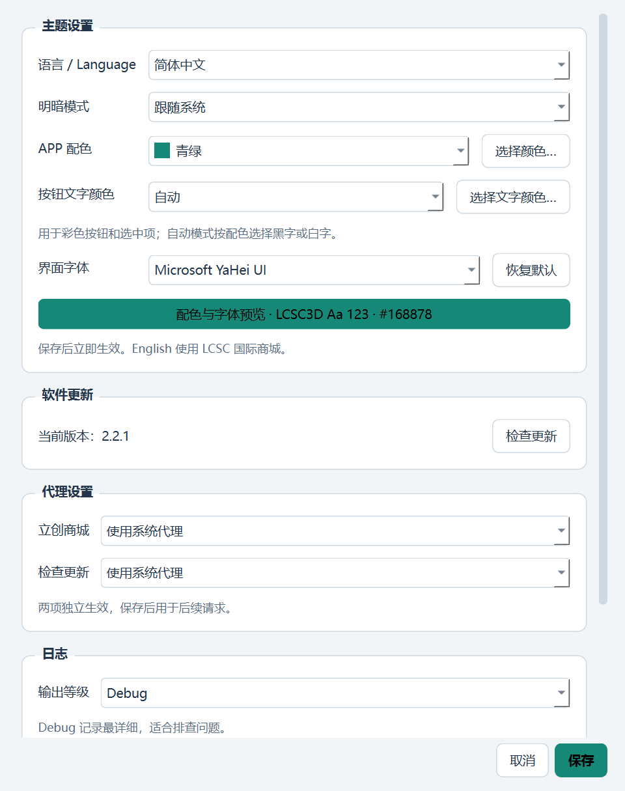
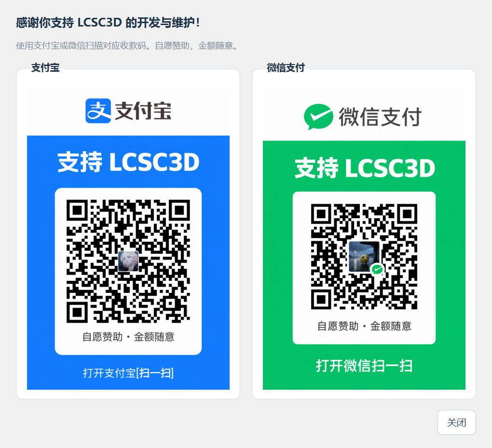

# LCSC3D 2.2.1

## 主题设置

- 简体中文 / English 即时切换，设置重启后保留；切换保留下载队列、导出路径和勾选状态。
- English 使用 LCSC 国际商城的数据：软件内搜索、分类筛选、50 项分页、英文参数、美元价格、库存、原图和加入下载列表。商品链接打开国际站；国际站登录与账号收藏在官方网站管理，不混用国内站会话。
- 跟随系统 / 浅色 / 深色，默认跟随系统，运行中同步系统明暗变化。
- 青绿、蓝色、紫色、玫红、橙色及自定义配色。按钮、选中状态、进度条与强调色同步更新。
- 新增 **按钮文字颜色**，支持自动、白色、黑色及“选择文字颜色…”自定义；手动颜色在切换配色与明暗模式后保留，可直接设置青绿配白字。
- 新增 **界面字体**，可从已安装字体中选择并预览，支持恢复默认及字体缺失时回退。保存后已有窗口和 3D 预览操作提示即时更新。
- 设置内容支持滚动，保存与取消按钮固定在底部。保存失败或取消时，当前语言与主题保持不变。

## 赞助与支持

设置窗口底部新增 **赞助与支持** 栏，包含两个按钮：

- **⭐点个Star⭐**：在默认浏览器中打开 LCSC3D 仓库首页。
- **🍔赞助作者🍔**：弹窗同时展示支付宝和微信收款码。图片随 EXE 打包，离线也可显示；关闭后返回设置窗口，保留尚未保存的修改。

自愿赞助，金额随意。感谢你支持项目的开发与维护！

详细操作见 [使用说明](../../app/README.md)，验证范围见 [验证记录](../验证记录.md)。
