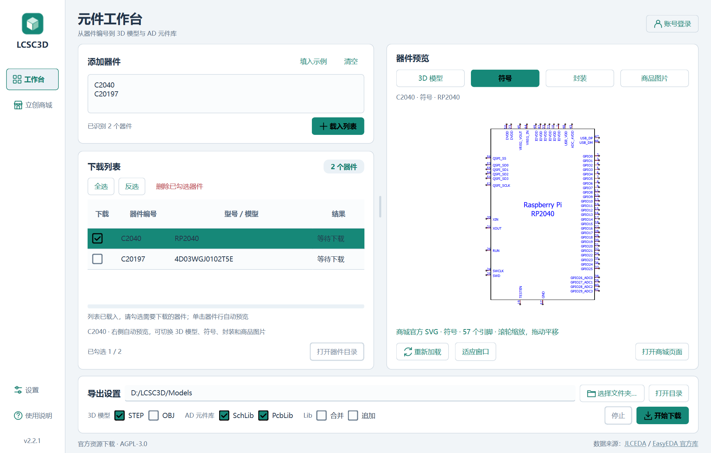
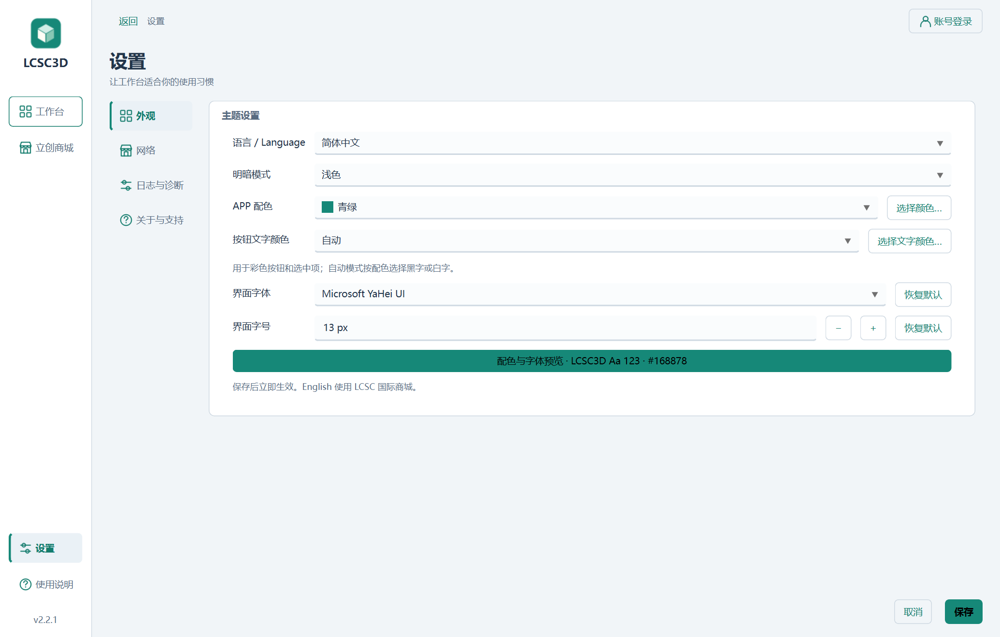
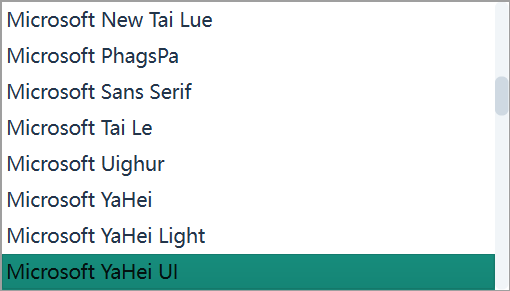
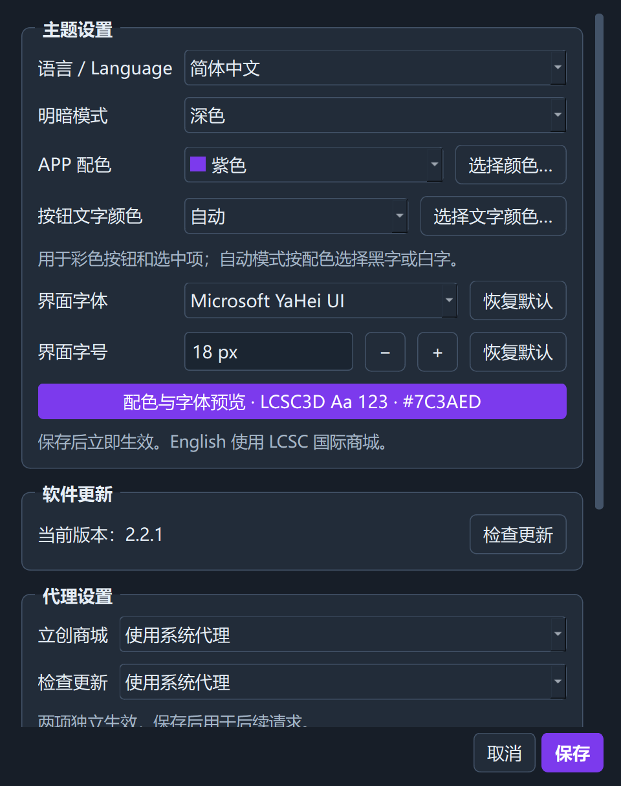
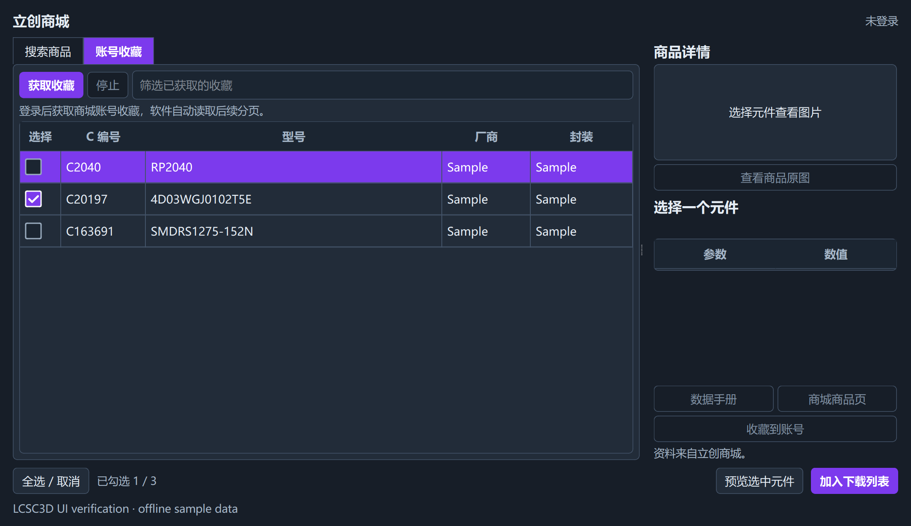

# LCSC3D 2.2.1

## 2026-10-10 本地 Material UI 重构

- 使用 UN-GCPDS/qt-material 2.17 的样式模板与图标，覆盖现有窗口、控件、菜单和提示，保留自定义主题及中文/英文切换。
- 主窗口改为左侧导航、下载列表与四类预览并排、底部导出设置；商城、登录、图片浏览、库追加、更新、帮助及文件/颜色选择均嵌入主窗口。
- 设置分为外观、网络、日志与诊断、关于与支持，分组标题放在框内左上角；恢复“⭐点个Star⭐”“🍔赞助作者🍔”原文。
- 提醒从右上角向左滑入；下拉列表在控件下方等宽展开，账号菜单各行等宽。
- 去除商城页签顶部白线，商城与工作台使用相同的拖动分隔条，勾选框改用完整 SVG 避免黑框和不平滑边缘。
- 主题缓存统一落在应用数据目录；构建脚本自动隔离测试配置和日志，并更新根目录交付 EXE。
- 这是 2.2.1 的本地重构构建，没有推送、打标签或发布新 Release。

## 原有主题设置功能（以下为重构前截图）

- 简体中文 / English 即时切换，设置重启后保留；切换保留下载队列、导出路径和勾选状态。
- English 使用 LCSC 国际商城的数据：软件内搜索、分类筛选、50 项分页、英文参数、美元价格、库存、原图和加入下载列表。商品链接打开国际站；国际站登录与账号收藏在官方网站管理，不混用国内站会话。
- 跟随系统 / 浅色 / 深色，默认跟随系统，运行中同步系统明暗变化。
- 青绿、蓝色、紫色、玫红、橙色及自定义配色。按钮、选中状态、进度条与强调色同步更新。
- 新增 **按钮文字颜色**，支持自动、白色、黑色及“选择文字颜色…”自定义；手动颜色在切换配色与明暗模式后保留，可直接设置青绿配白字。
- 新增 **界面字体**，可从已安装字体中选择并预览，支持恢复默认及字体缺失时回退。保存后已有窗口和 3D 预览操作提示即时更新。
- 修复字体下拉列表展开时占满屏幕的问题：宽度跟随选择框，最多显示 8 项；支持滚动、键盘选择与 Esc 收起，字体效果在下方预览。
- 新增 **界面字号**：10–24px，默认 13px，支持输入、加减、预览、保存记忆及单独恢复默认；标题、提示文字、表格行高和 3D 操作提示同步调整，大字号下主窗口内容可滚动。
- 修复深色模式勾选框不明显的问题：普通复选框、商城与下载列表使用清晰描边和高对比度勾号，覆盖未勾选、勾选、半选及禁用状态。
- 设置内容支持滚动，保存与取消按钮固定在底部。保存失败或取消时，当前语言与主题保持不变。

## 赞助与支持

设置窗口底部新增 **赞助与支持** 栏，包含两个按钮：

- **⭐点个Star⭐**：在默认浏览器中打开 LCSC3D 仓库首页。
- **🍔赞助作者🍔**：弹窗同时展示支付宝和微信收款码。图片随 EXE 打包，离线也可显示；关闭后返回设置窗口，保留尚未保存的修改。

自愿赞助，金额随意。感谢你支持项目的开发与维护！

详细操作见 [使用说明](../../app/README.md)，验证范围见 [验证记录](../验证记录.md)。
