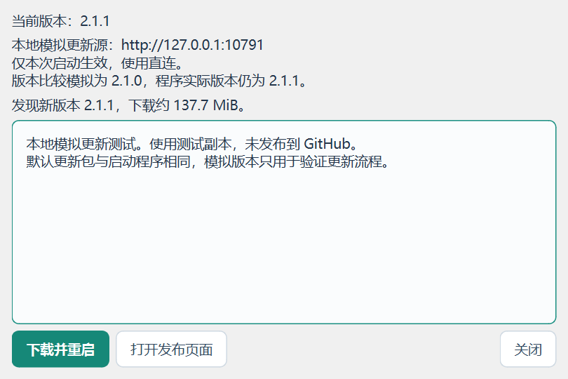

# 不发布 GitHub 的本地更新测试

在 Windows 上运行仓库中的启动脚本即可。脚本只依赖 Python 标准库；更新过程运行实际 EXE。

```powershell
python F:\JLC3DViewer\scripts\local_update_test.py
```

脚本默认读取 `outputs/LCSC3D.exe`，启动仅监听 `127.0.0.1` 随机端口的更新服务，并打开隔离的 EXE 副本。测试窗口标题带有“本地更新测试”。在该窗口中点击“检查更新”→“下载并重启”，会实际请求版本元数据、下载校验文件和 EXE、校验 SHA-256、启动助手、退出原程序、替换、重启并确认。

默认模拟当前版本 **2.1.0**、目标版本 **2.1.1**。更新包和原程序都是当前成品的副本，EXE 内的实际版本始终是 2.1.1；这样无需构建旧版本就能验证整条更新流程。完成重启后会恢复用实际版本判断，再检查将显示已是最新版。



测试时保持终端运行。完成后回到终端按 **Ctrl+C**，脚本停止本地服务并关闭本次测试副本。正式 `outputs/LCSC3D.exe`、真实设置和登录会话保留。测试不会创建或发布 GitHub Release。

## 文件位置

所有本次测试文件位于 `%LOCALAPPDATA%\LCSC3D\update-tests\run-随机编号\`：

- `app/LCSC3D.exe`：本次运行和替换的程序副本。
- `server/LCSC3D.exe`：本地服务提供的更新包副本。
- `profile/LCSC3D/`：隔离的设置、运行时、日志及更新暂存/备份。
- `verification.json`：测试结果；自动模式另有 `ui-verification.json` 和更新窗口截图。

终端会打印准确目录。保留文件便于复查；测试结束后可手动删除对应 `run-随机编号` 目录。

## 自动验证和异常场景

自动点击实际 EXE 的两个按钮并核对结果：

```powershell
python F:\JLC3DViewer\scripts\local_update_test.py --auto
```

退出码 0 且 `verification.json` 中 `success: true` 表示本次场景通过。成功场景核对 SHA-256、启动确认、设置保留和 EXE 目录清洁。原程序与新程序均来自隔离副本。

模拟下载完成后校验不一致，应显示 SHA-256 错误、保留原程序并清除未完成的暂存：

```powershell
python F:\JLC3DViewer\scripts\local_update_test.py --scenario bad-checksum
```

模拟没有新版，应显示“当前已是最新版本”：

```powershell
python F:\JLC3DViewer\scripts\local_update_test.py --scenario no-update
```

两个异常/边界场景也支持追加 `--auto`。`--delay-ms 50` 可放慢下载，便于手动测试取消或关闭更新窗口。

## 自选更新包

```powershell
python F:\JLC3DViewer\scripts\local_update_test.py --exe F:\测试程序\LCSC3D.exe --candidate-exe F:\待验证程序\LCSC3D.exe --current-version 2.1.0 --target-version 2.1.1
```

`--exe` 是被测试程序，必须支持本地更新入口；原始 2.1.0 没有这个入口。候选 EXE 也须支持入口参数。`--current-version` 只影响版本比较；`--target-version` 是服务声明的版本，应与候选程序实际版本一致。脚本始终复制两个文件后操作。

## 入口与正式更新隔离

应用内部入口为 `--local-update-source http://127.0.0.1:端口`，可搭配 `--local-update-current-version X.Y.Z`。这两个参数只影响本次进程，不保存到设置；建议始终使用上面的脚本自动准备隔离目录。

本地模式只允许指定的数字回环地址和端口，所有请求固定直连；资产地址和重定向不能切换到外部服务器或其他端口。本地服务只提供固定的元数据、校验文件、单个 EXE 和测试说明，不提供目录浏览或任意文件下载。

普通启动继续使用 GitHub 正式发行源和用户的更新代理设置，不读取本地测试环境变量。生产模式不接受 HTTP 本地源，原有版本、文件大小、SHA-256 校验和失败回滚保持有效。
